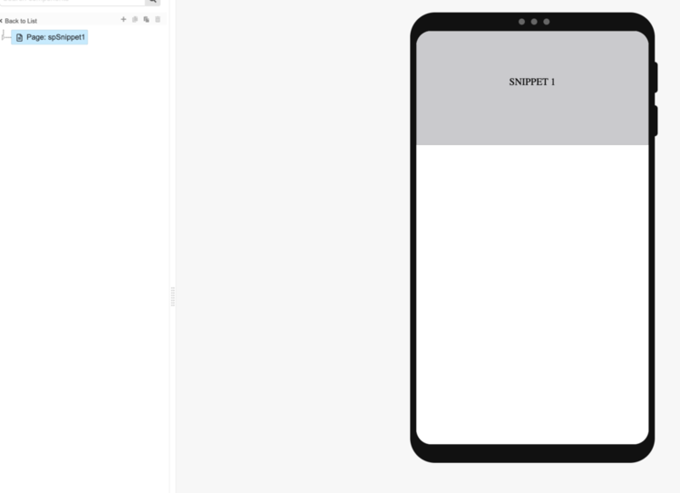
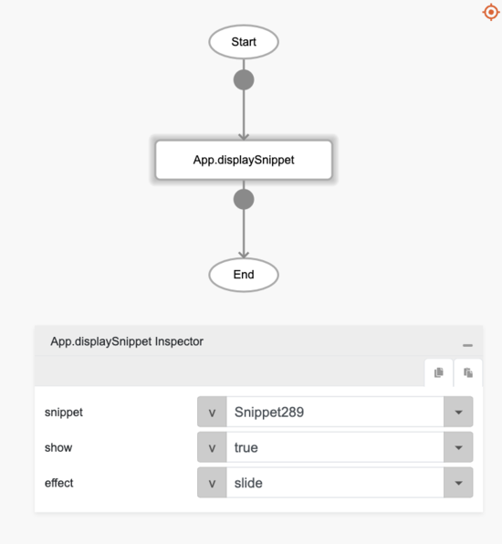
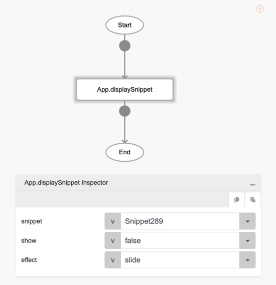
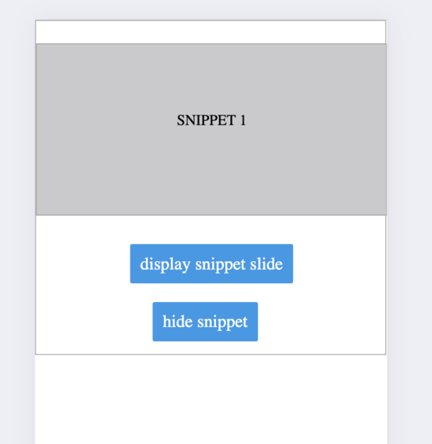

# displaySnippet

## Description

Allows users to decide whether to show or hide a snippet on the screen.

## Input / Parameter

| Name | Description | Input Type | Default | Options | Required |
| ------ | ------ | ------ | ------ | ------ | ------ |
| snippet | The snippet to be shown or hidden. | String/Text | - | - | Yes |
| show | To show or hide snippet. | Boolean | true | true, false | Yes |
| effect | The animation effect of the snippet. | String | None | None, Fade, Slide | No |

## Output

Note: The page will be updated to show or hide the snippet.

## Example

In this example, we will hide and show a snippet with slide effect in the snippet component.

### Steps

1. First, we will need to have a snippet to display or hide. Create one under the Snippet tab if you don't have any yet. In this example, we will be using a snippet named `Snippet1`.

    

2. Drag in a snippet component and two buttons, one to hide the snippet and one to show it. 
   
    

3. In the event `press` of the button fill in the parameters as shown below for both buttons. 
   
    
    

### Result

1. Try clicking the hide button first and then the show button in either Preview or Compiled App. 

