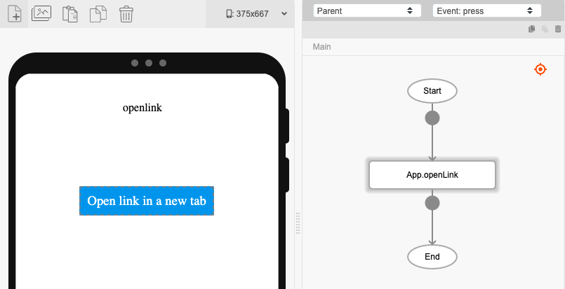
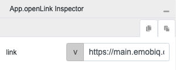
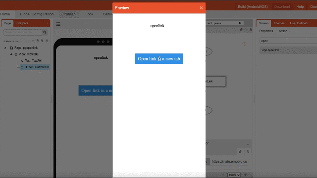

# App.openLink

## Description

Opens a link in a new tab in a mobile web browser.

## Input / Parameter

| Name | Description | Input Type | Default | Options | Required |
| ------ | ------ | ------ | ------ | ------ | ------ |
| link | The link to be opened. | String/Text | - | - | Yes |

## Output

| Description | Output Type |
| ------ | ------ |
| Returns the formatted information. | Object |

### Object

| Key | Description | Output Type |
| ------ | ------ | ------ |
| success | Boolean value to denote whether the function was executed successfully. | Text |
| message | The message to print. | Text |
| data | Any additional message or data to print. | Text |

## Example

In this example, we will use the `App.reload` function to open the link for the eMOBIQ dashboard in another tab.

### Steps

1. Drag a button component to the canvas and click on the 'Action' tab.
2. Drag the `App.openlink` function to the event flow under the 'press' event.

3. Under the inspector of the component, enter the link you want to open. In this example, we are using `https://main.emobiq.com/`, the link to the eMOBIQ dashboard.

### Result

1. Save and preview the app.
2. Click the button to open the dashboard in another tab.

