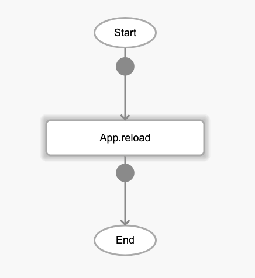

# App.reload

## Description

Refreshes the current page.

## Input / Parameter

N/A

## Output

| Description | Output Type |
| ------ | ------ |
| Returns the formatted information. | Object |

### Object

| Key | Description | Output Type |
| ------ | ------ | ------ |
| success | Boolean value to denote whether the function was executed successfully. | Text |
| message | The message to print. | Text |
| data | Any additional message or data to print. | Text |

## Example

In this example, we will use the `App.reload` function to reload the current page.

### Step

1. Call the function.

    

        
    

### Result

The page will be reloaded.