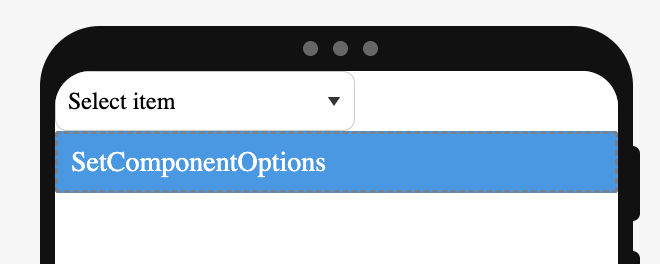
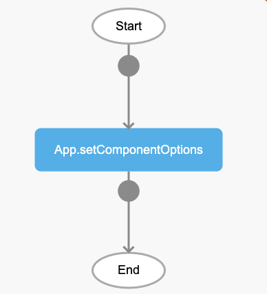
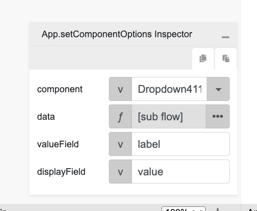
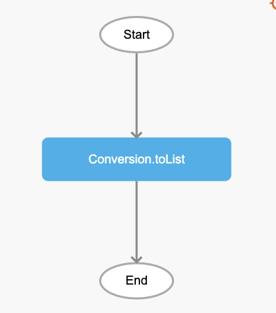
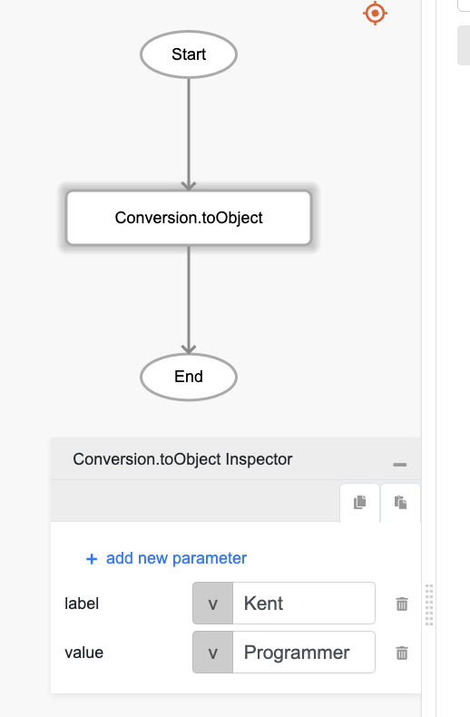

# App.setComponentOptions

## Description

Allows users to set a value to a component.

## Input / Parameter

| Name | Description | Input Type | Default | Options | Required |
| ------ | ------ | ------ | ------ | ------ | ------ |
| component | The name of the component. | String/Text | - | - | Yes |
| data | The id of the component. | Array/List | - | - | Yes |
| valueField | The name of the attribute from the list of options (from data parameter) to be as the value of the dropdown options. | String/Text | - | - | Yes |
| displayField | The name of the attribute from the list of options (from data parameter) to be as the display of the dropdown options.  | String/Text | - | - | Yes |

## Output

| Description | Output Type |
| ------ | ------ |
| Returns the formatted information. | Object |

Note: The component will be updated to show the value that has been set to it.

### Object

| Key | Description | Output Type |
| ------ | ------ | ------ |
| success | Boolean value to denote whether the function was executed successfully. | Text |
| message | The message to print. | Text |
| data | Any additional message or data to print. | Text |

## Callback

N/A

## Video

## Example

### Steps

In this example we have a button (in blue) that when clicked will populate the dropdown of the component

1. First, we drag a button and a dropdown input onto the Editor.
2. Select the button and under the 'Actions' tab, drag the `App.setComponentOptions` into the flow for the button. 

3. Under the inspector for this function, select the component whose dropdown you would be populating, which in this example is `Dropdown411`, and then fill in valueField and displayField

4. Enter the `Conversion.toList` for the value of data, and then `Conversion.toObject` inside it. The object must follow valueField and displayField that has been set 

### Result

1. Save and preview your app. 
2. Now when you click the button, it will set the dropdown of Dropdown411