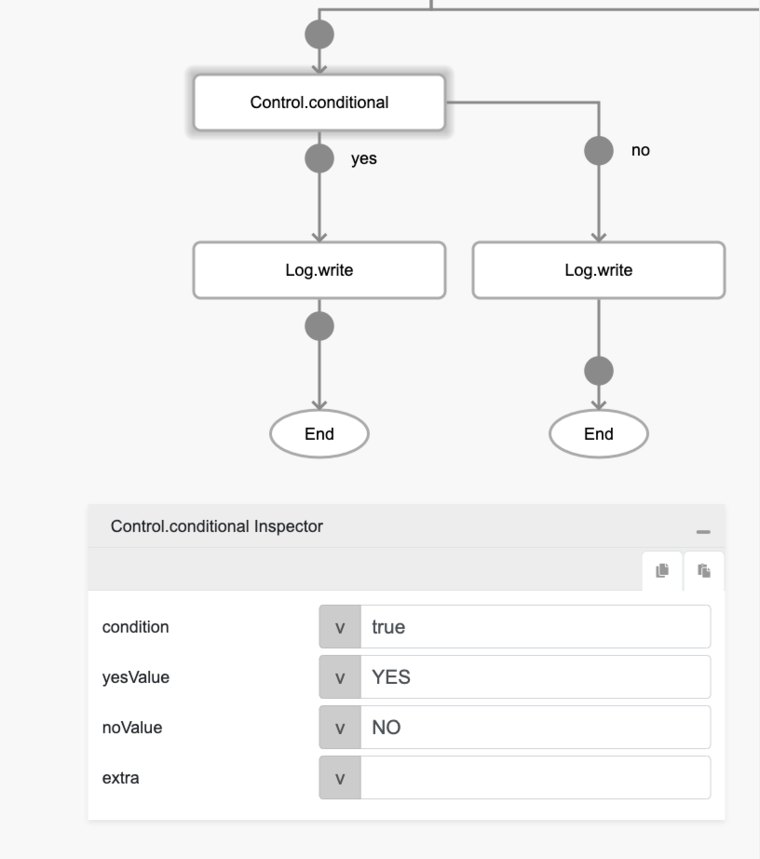

# Control.conditional

## Description

Validates the condition passed.

## Input / Parameter

| Name | Description | Input Type | Default | Options | Required |
| ------ | ------ | ------ | ------ | ------ | ------ |
| condition | The condition to be validated. | Boolean | false | - | No |
| yesValue | The output value if condition is 'true'. | Any | - | - | No |
| noValue | The output value if condition is 'false'. | Any | - | - | No |
| extra | The stored value that is passed to all the callbacks. | Any | - | - | No |

## Output

| Description | Output Type |
| ------ | ------ |
| Returns the 'yesValue' or 'noValue'. | Any |

## Callback

### yesCallback

The action performed if the condition is true.

### noCallback

The action performed if the condition is false.

## Video

Coming Soon.

## Example

The user wants to print out a value based on a conditional, for the sake of example we will use `true` or `false` for the parameter `condition` directly, but you can use functions from the likes of `Logic` category for this.

### Step

1. Call the function `Object.conditional`, and then Call the function `Log.write` on both `yes` and `no` callbacks. Both of the `Log.write` shall have parameter type of `input`.
Sample parameters are shown in the picture below.
     

    

### Result

The console will print `YES`.

## Related Information