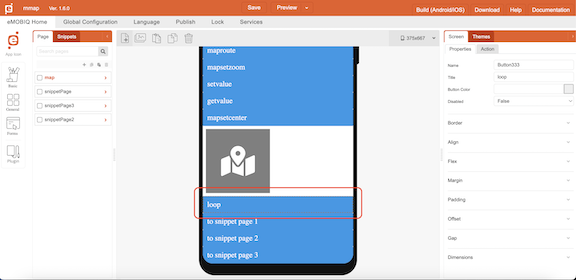
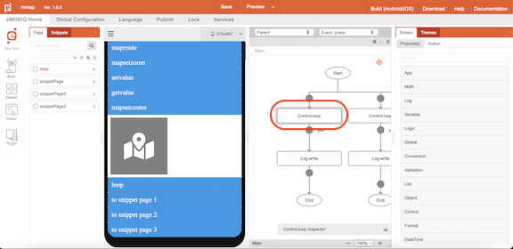
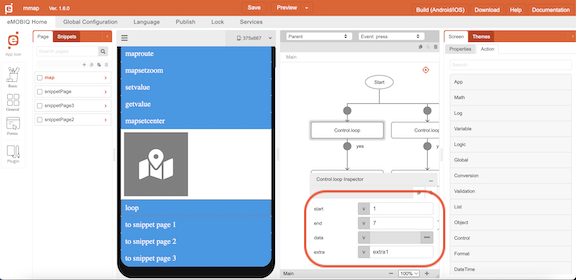
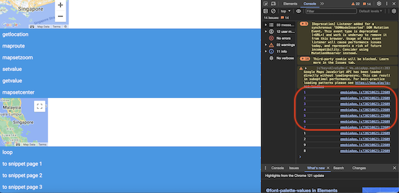

# Control.loop

## Description

Loop through a range of values or a list of elements

## Input / Parameter

| Name | Description | Input Type | Default | Options | Required |
| ------ | ------ | ------ | ------ | ------ | ------ |
| start | The starting point of the range of values to loop through. | Number | - | - | required if “data” has no input |
| end | The ending point of the range of values to loop through. | Number | - | - | required if “data” has no input |
| data | The list of elements to map. | Array | - | - | required if “start” OR “end” has no input |
| extra | Additional data to be used in the callbacks. | Any | - | - | No | 

## Output

Formatted Result

## Callback

### callback

The function to be executed when the loop run successfully.

<!-- Format:  -->

## Example

The user wants to show a list of number on their console.

<!-- Share a scenario, like a user requirements. -->

### Steps

| No. | Description |  |
| ------ | ------ | ------ |
| 1. |  | Drag a button component to a page in the mobile designer and open up the `Action` tab. |
| 2. |  | Select the event `click` and drag the `Control.loop` function to the event flow. |
| 3. |  | Fill in the parameters of the function. |
| 4. |  | Drag the function to be executed if the loop function is successful to the node below the function. In this example, we are using the `Log.write` function and change the parameters dropdown to use `input` |
| 5. |  | Check the console from preview. |

<!-- Show the steps and share some screenshots.

1. .....

Format:  -->

### Result

The path of the audio file will be shown in the console.

<!-- Explain the output.

Format:  -->

## Links
