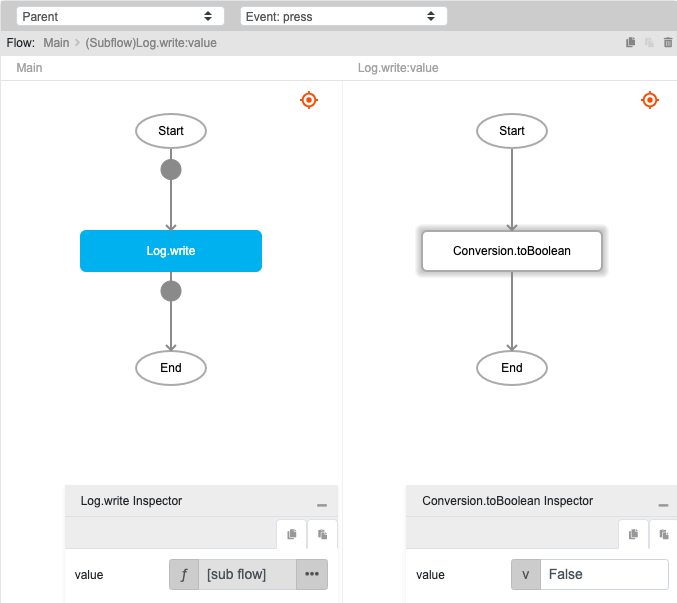

# Conversion.toBoolean

## Description

A value of any type is converted to boolean type.

## Input / Parameter

| Name | Description | Input Type | Default | Options | Required |
| ------ | ------ | ------ | ------ | ------ | ------ |
| value | The value to be converted to boolean. | Any | - | - | Yes |

## Output

| Description | Output Type |
| ------ | ------ |
| Returns the converted value as boolean type. | Boolean |

## Example

In this example, we will convert a string to boolean and print the result in the console.

### Step

1. Call the function `Conversion.toBoolean` inside the `Log.write` function.
2. Enter the value of the `Conversion.toBoolean` function. In this example, we will enter 'False'.

### Result

1. The console will print 'false' since the `value` is 'False'.

