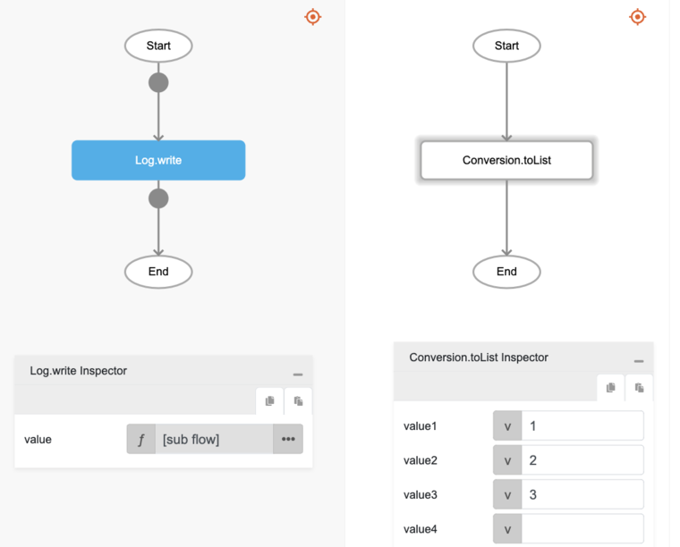
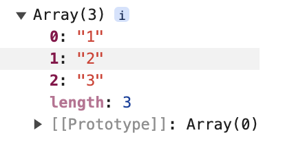

# Conversion.toList

## Description

Creates a list using the values provided or creates a new list.

## Input / Parameter

| Name | Description | Input Type | Default | Options | Required |
| ------ | ------ | ------ | ------ | ------ | ------ |
| value1 | The first value to add in the list. | Any | - | - | No |
| value2 | The second value to add in the list. | Any | - | - | No |
| value3 | The third value to add in the list. | Any | - | - | No |
| value4 | The fourth value to add in the list. | Any | - | - | No |
| value5 | The fifth value to add in the list. | Any | - | - | No |
| value6 | The sixth value to add in the list. | Any | - | - | No |
| value7 | The seventh value to add in the list. | Any | - | - | No |
| value8 | The eight value to add in the list. | Any | - | - | No |
| value9 | The ninth value to add in the list. | Any | - | - | No |
| value10 | The tenth value to add in the list. | Any | - | - | No |

## Output

| Description | Output Type |
| ------ | ------ |
| Returns the new list with the passed data. | List |

## Example

The user wants to create an array of values and print the result in the console.

### Step

1. Call the function `Conversion.toList` inside the `Log.write` function.
2. Enter the value for the `Conversion.toList` function. In this example, we will enter 1, 2, 3.

### Result

1. The console will print an array of numbers as depicted below.

