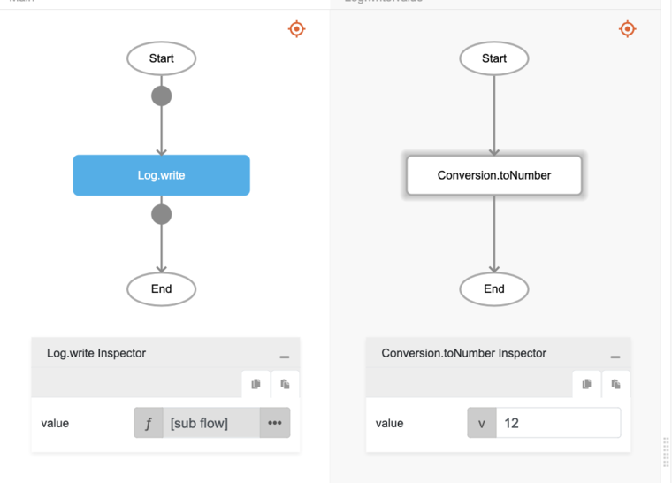

# Conversion.toNumber

## Description

Any number or text is converted to number type.

## Input / Parameter

| Name | Description | Input Type | Default | Options | Required |
| ------ | ------ | ------ | ------ | ------ | ------ |
| value | The value to be converted to number. | Text / Number | - | - | Yes |

## Output

| Description | Output Type |
| ------ | ------ |
| Returns the converted value as number type. | Number |

## Example

In this example, we will convert a string to number and print the result in the console.

### Step

1. Call the function `Conversion.toNumber` inside the `Log.write` function.
2. Enter the value for the `Conversion.toNumber` function. In this example, we will enter 12.

### Result

1. The console will print `12`.

