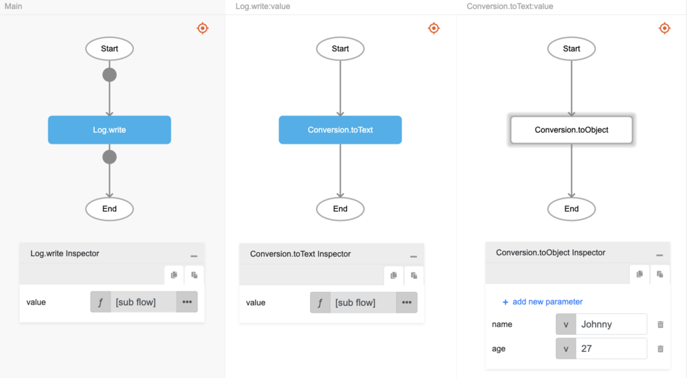
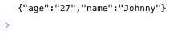

# Conversion.toText

## Description

A value of any type is converted to text type.

## Input / Parameter

| Name | Description | Input Type | Default | Options | Required |
| ------ | ------ | ------ | ------ | ------ | ------ |
| value | The value to be converted to text. | Any | - | - | Yes |

## Output

| Description | Output Type |
| ------ | ------ |
| Returns the converted value as text type. | Text |

## Example

In this example, we will convert an object to a string and print the result in the console.

### Step

1. Call the function `Conversion.toText` inside the `Log.write` function, and then call the function `Conversion.toObject` inside `Conversion.toText`

2. Call the function `Conversion.toObject` inside the `Conversion.toText` function and enter the values for the object {name:Johnny, age:27}. (Refer to  [`toObject`](./toObject) for more information on using the `toObject` function.)

    

        
    

### Result

1. The console will print the value passed as a text. In this example, the value printed is `{"age":"27","name":"Johnny"}`.

    

        
    

