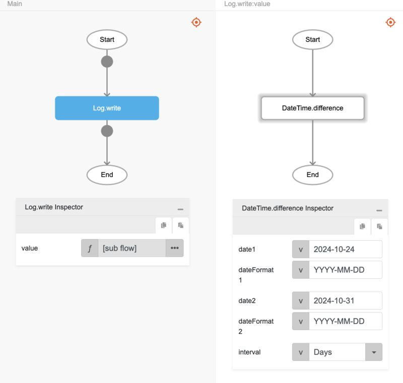

# DateTime.difference

## Description

Computes the difference between two dates or datetimes.

## Input / Parameter

| Name | Description | Input Type | Default | Options | Required |
| ------ | ------ | ------ | ------ | ------ | ------ |
| date1 | The date to be subtracted from the second date. | Text | - | - | Yes |
| dateFormat1 | The date and/or time format to use. | Text | yyyy-MM-dd HH:mm:ss | yyy-MM-dd HH:mm:ss, yyyy-MM-dd, HH:mm:ss, y, M, d, h, H, m, s, S, E, z | No |
| date2 | The date to subtract the first date from. | Text | - | - | Yes |
| dateFormat2 | The date and/or time format to use. | Text | yyyy-MM-dd HH:mm:ss | yyy-MM-dd HH:mm:ss, yyyy-MM-dd, HH:mm:ss, y, M, d, h, H, m, s, S, E, z | No |
| interval | The type of time interval to be used to compute the difference. | Text | Days | Days, Years, Months, Weeks, Hours, Minutes, Seconds | No |

### Supported date pattern letters

#### Years:
- `YYYY`: 4-digit year (e.g., 2021)
- `YY`: 2-digit year (e.g., 21 for 2021)

#### Months:
- `MMMM`: Full month name (e.g., January, February)
- `MMM`: Short month name (e.g., Jan, Feb)
- `MM`: Month as a 2-digit number (01 for January)
- `M`: Month as a number (1 for January)

#### Days:
- `DD`: Day of the month as a 2-digit number (e.g., 09)
- `D`: Day of the month as a number (e.g., 9)
- `dddd`: Full day name (e.g., Monday, Tuesday)
- `ddd`: Short day name (e.g., Mon, Tue)

#### Hours:
- `HH`: Hours (24-hour clock) as a 2-digit number
- `H`: Hours (24-hour clock) as a number
- `hh`: Hours (12-hour clock) as a 2-digit number
- `h`: Hours (12-hour clock) as a number

#### Minutes:
- `mm`: Minutes as a 2-digit number
- `m`: Minutes as a number

#### Seconds:
- `ss`: Seconds as a 2-digit number
- `s`: Seconds as a number

#### AM/PM:
- `A`: AM/PM uppercase
- `a`: am/pm lowercase

#### Time Zone:
- `Z`: UTC offset (e.g., +07:00)
- `ZZ`: UTC offset in a compact format (e.g., +0700)

These symbols can be combined in any way to match the format of your input date string. For example:

- `YYYY-MM-DD`: Represents dates like "2021-03-14"
- `dddd, MMMM Do YYYY, h:mm:ss a`: Represents dates like "Sunday, March 14th 2021, 5:30:45 pm"

Remember, the format in parameter `dateFormat1` should match the structure of `date1` you're parsing, the same is also true for `dateFormat2` and `date2`.

## Output

| Description | Output Type |
| ------ | ------ |
| Returns the difference in the date or datetime values based on the type of time interval(s) selected. | Number |

## Example

In this example, we will get the difference between 2 dates (in days) and print the result in the console.

### Step

1. Drag a `button` component into the canvas and open the `Action` tab. Select the `press` event of the button and drag the `Log.write` function to the event flow.
2. Call the function `DateTime.difference` inside the `Log.write` function.
3. Sample parameters are shown in the picture below.

### Result

1. The console will print the difference between the two dates passed.

