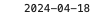

# DateTime.get

## Description

Retrieves the current date and/or time information.

## Input / Parameter

| Name | Description | Input Type | Default | Options | Required |
| ------ | ------ | ------ | ------ | ------ | ------ |
| type | The type of date and/or time information to retrieve. | Text | Date_Time | Date_Time, Date, Time | No |

## Output

| Description | Output Type |
| ------ | ------ |
| Returns the current date and/or time information. | Text |

## Example

In this example, we will get the current date and print it in the console.

### Step

1. Drag a `button` component into the canvas and open the `Action` tab. Select the `press` event of the button and drag the `Log.write` function to the event flow.
2. Call the function `DateTime.get` inside the `Log.write` function.
3. Sample parameters are shown in the picture below.

### Result

1. The console will print the current date.

