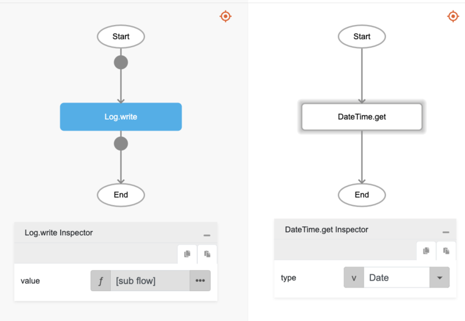

# DateTime.get

## Description

Retrieves the current date and/or time information.

## Input / Parameter

| Name | Description | Input Type | Default | Options | Required |
| ------ | ------ | ------ | ------ | ------ | ------ |
| type | The type of date and/or time information to retrieve. | Text | Date_Time | Date_Time, Date, Time | No |

## Output

| Description | Output Type |
| ------ | ------ |
| Returns the current date and/or time information. | Text |

## Callback

N/A

## Video

Coming Soon.

## Example

The user wants to get the current Date.

### Step

1. Call the function `DateTime.get` inside the `Log.write` function.
Sample parameters are shown in the picture below.
     

    

### Result

The console will print the current Date, when this documentation was made the result was `2024-02-18`.

## Related Information