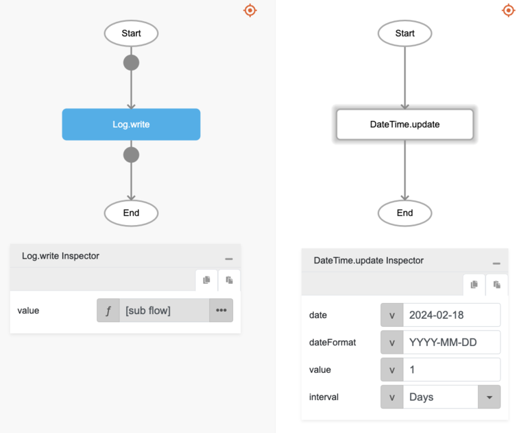

# DateTime.update

## Description

Allows users to add days, hours, minutes and seconds to a certain date.

## Input / Parameter

| Name | Description | Input Type | Default | Options | Required |
| ------ | ------ | ------ | ------ | ------ | ------ |
| date | The reference date to be updated. | Text | - | - | Yes |
| dateFormat | The date and/or time format to use. | Text | yyyy-MM-dd HH:mm:ss | yyy-MM-dd HH:mm:ss, yyyy-MM-dd, HH:mm:ss, y, M, d, h, H, m, s, S, E, z | No |
| value | The value to be added to the date. | Number | - | - | Yes |
| interval | The type of time interval to be added to the date. | Text | Days | Days, Years, Months, Weeks, Hours, Minutes, Seconds | No |
 
### Supported date pattern letters

#### Years:
- `YYYY`: 4-digit year (e.g., 2021)
- `YY`: 2-digit year (e.g., 21 for 2021)

#### Months:
- `MMMM`: Full month name (e.g., January, February)
- `MMM`: Short month name (e.g., Jan, Feb)
- `MM`: Month as a 2-digit number (01 for January)
- `M`: Month as a number (1 for January)

#### Days:
- `DD`: Day of the month as a 2-digit number (e.g., 09)
- `D`: Day of the month as a number (e.g., 9)
- `dddd`: Full day name (e.g., Monday, Tuesday)
- `ddd`: Short day name (e.g., Mon, Tue)

#### Hours:
- `HH`: Hours (24-hour clock) as a 2-digit number
- `H`: Hours (24-hour clock) as a number
- `hh`: Hours (12-hour clock) as a 2-digit number
- `h`: Hours (12-hour clock) as a number

#### Minutes:
- `mm`: Minutes as a 2-digit number
- `m`: Minutes as a number

#### Seconds:
- `ss`: Seconds as a 2-digit number
- `s`: Seconds as a number

#### AM/PM:
- `A`: AM/PM uppercase
- `a`: am/pm lowercase

#### Time Zone:
- `Z`: UTC offset (e.g., +07:00)
- `ZZ`: UTC offset in a compact format (e.g., +0700)

## Output

| Description | Output Type |
| ------ | ------ |
| Returns the updated date including the type of time interval(s) selected. | Text |
 

## Callback

N/A

## Video

Coming Soon.

## Example

The user wants to add 1 day to a Date.

### Step

1. Call the function `DateTime.update` inside the `Log.write` function.
Sample parameters are shown in the picture below.
     

    

### Result

The console will print `2024-02-19`.

## Related Information