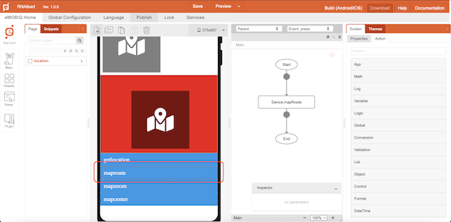
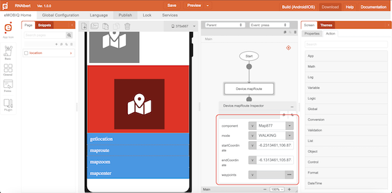

# Device.mapRoute

## Description

Display the route on the map from the start position to end position.

## Input / Parameter

| Name | Description | Input Type | Default | Options | Required |
| ------ | ------ | ------ | ------ | ------ | ------ |
| component | The name of the map component. | Text | - | - | Yes |
| mode | The route mode to show. | Text | - | DRIVING, WALKING, BICYCLING, TRANSIT | - |
| startCoordinate | The latitude and longitude of the start position. Format: latitude, longitude | Text | - | - | Yes |
| endCoordinate | The latitude and longitude of the end position. Format: latitude, longitude | Text | - | - | Yes |
| waypoints | The waypoints on the route. Format: ['latitude, longitude'] | Array | - | - | - |

## Output

N/A

## Example

The user wants to set their route on Map component by using mapRoute function

<!-- Share a scenario, like a user requirements. -->

### Steps

| No. | Description |  |
| ------ | ------ | ------ |
| 1. |  | Make sure Map component is exist on the page and add a button component on that page |
| 2. |  | Select the event `press` for the button and drag the function `Device.mapRoute` to the event flow. |
| 3. |  | Fill in the parameters of the function. |

### Result

The Map component should show the route based from `Device.mapRoute` function

<!-- Explain the output.

Format:  -->

## Links