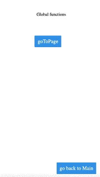

# Global.goToPage

## Description

Allows users to redirect from the current page they are on to another page.

## Input / Parameter

| Name | Description | Input Type | Default | Options | Required |
| ------ | ------ | ------ | ------ | ------ | ------ |
| page | The name of the page to navigate to. | String/Text | - | - | Yes |

## Output

| Description | Output Type |
| ------ | ------ |
| Returns the formatted information. | Object |

Note: The page will be updated to show the page selected by the user.

## Example

In this example, we will navigate to the main page by clicking a button on the current page.

### Steps

1. Drag a `button` to a page in the mobile designer. Select the event `press` for the button and drag the `Global.goToPage` function to the event flow. 
2. Choose the page to navigate to from the dropdown in the `page` parameter.

### Result

1. When the button is pressed, the page navigates to pgMain.

