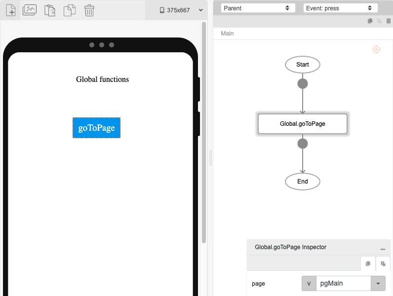

# Global.goToPage

## Description

Allows users to redirect from the current page they are on to another page.

## Input / Parameter

| Name | Description | Input Type | Default | Options | Required |
| ------ | ------ | ------ | ------ | ------ | ------ |
| page | The name of the page to navigate to. | String/Text | - | - | Yes |

## Output

| Description | Output Type |
| ------ | ------ |
| Returns the formatted information. | Object |

Note: The page will be updated to show the page selected by the user.

## Callback

N/A

## Video

Coming Soon.

<!-- Format:  -->

## Example

The user wants to navigate to another page.

<!-- Share a scenario, like a user requirements. -->

### Steps

1. Drag a button to a page in the mobile designer. Select the event `click` for the button and drag the `Global.goToPage` function to the event flow. Choose the page from the dropdown of `page` field.
  

### Result

When the button is pressed, the page navigates to pgWelcome.

## Related Information