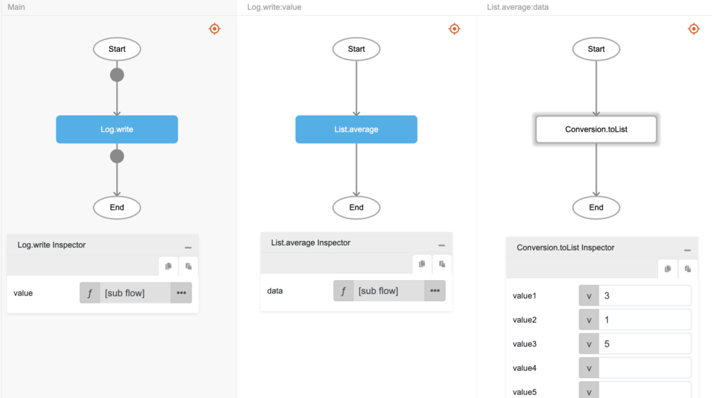
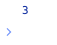

# List.average

## Description

Returns the average value of all the numbers in a list.

## Input / Parameter

| Name | Description | Input Type | Default | Options | Required |
| ------ | ------ | ------ | ------ | ------ | ------ |
| data | The list of numbers to return the average of. | List | - | - | Yes |

## Output

| Description | Output Type |
| ------ | ------ |
| Returns the average value of the numbers in the list. | Number |

## Example

In this example, we we will get the average of numbers in a list and print the result in the console.

### Step

1. Call the function `List.average` inside the `Log.write` function.
2. Then call the function `Conversion.toList` inside the `List.average` function.
3. Enter the data inside the `Conversion.toList` function. In this example, we will enter "3, 1, 5".

### Result

1. The console will print the average value. In this example, the value printed will be `3`.

