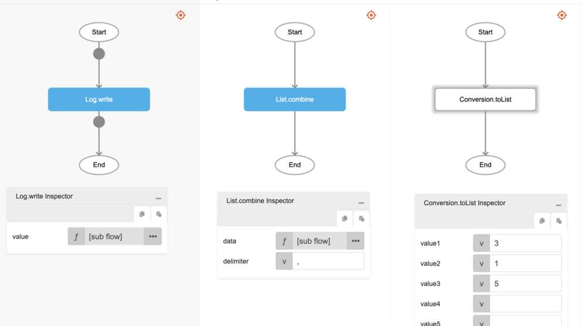

# List.combine

## Description

Combines elements in a list into a string of text using a delimiter.

## Input / Parameter

| Name | Description | Input Type | Default | Options | Required |
| ------ | ------ | ------ | ------ | ------ | ------ |
| data | The list of elements to be converted to a string of text. | List | - | - | Yes |
| delimiter | The separator between each element to form a complete text. | Text | - | - | No |

## Output

| Description | Output Type |
| ------ | ------ |
| Returns the concatenated string of text. | Text |

## Callback

N/A

## Video

Coming Soon.

## Example

The user wants to turn a List into a comma-separated string and print the result in the console.
 

### Step

1. Call the function `List.combine` inside the `Log.write` function, and then Call the function `Conversion.toList` inside the `List.combine`.
     

    

### Result

The console will print `3,1,5`.

## Related Information