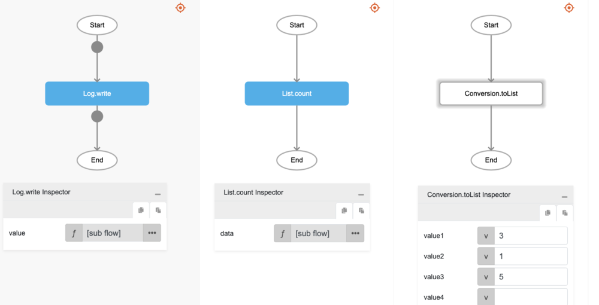

# List.count

## Description

Counts the number of elements in a list.

## Input / Parameter

| Name | Description | Input Type | Default | Options | Required |
| ------ | ------ | ------ | ------ | ------ | ------ |
| data | The list of elements to count. | List | - | - | Yes |

## Output

| Description | Output Type |
| ------ | ------ |
| Returns the total number of the elements in the list. | Number |

## Callback

N/A

## Video

Coming Soon.

## Example

The user wants to count the number of elements in a List and print the result in the console.
 

### Step

1. Call the function `List.count` inside the `Log.write` function, and then Call the function `Conversion.toList` inside the `List.count`.
     

    

### Result

The console will print `3`.

## Related Information