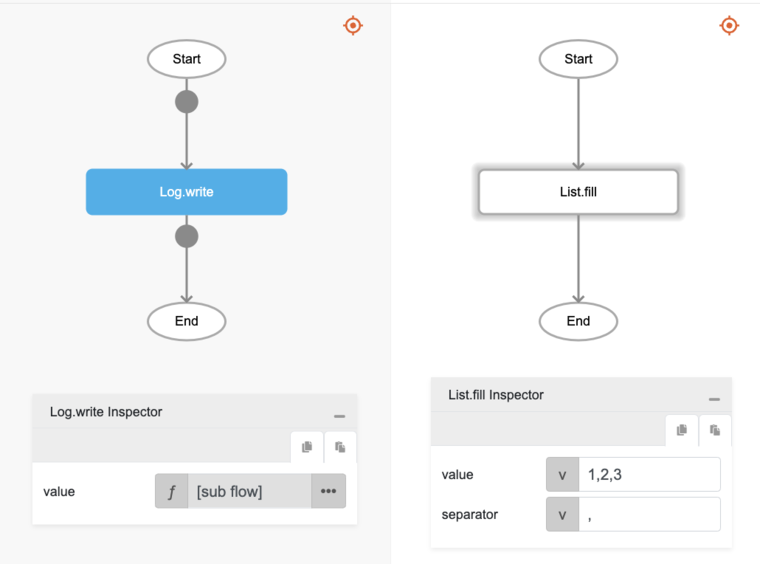

# List.fill

## Description

Fills a string of text into a list using a separator.

## Input / Parameter

| Name | Description | Input Type | Default | Options | Required |
| ------ | ------ | ------ | ------ | ------ | ------ |
| value | The string of text to be converted to a list. | Text | - | - | Yes |
| separator | The separator between texts to create the required format for the list. | Text | - | - | Yes |

## Output

| Description | Output Type |
| ------ | ------ |
| Returns the list of separated strings of text. | List |

## Callback

N/A

## Video

Coming Soon.

## Example

The user wants to turn a comma-separated string into a List and print the result in the console.
 

### Step

1. Call the function `List.fill` inside the `Log.write` function.
     
    value : "1,2,3"
    separator: ","

    

### Result

The console will print `['1', '2', '3']`.

## Related Information