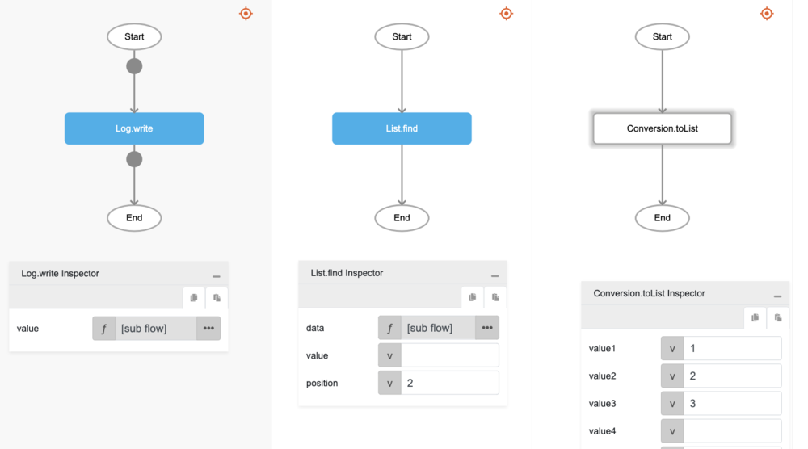

# List.find

## Description

Returns the position of an element in a list or the element at a specified position.

## Input / Parameter

| Name | Description | Input Type | Default | Options | Required |
| ------ | ------ | ------ | ------ | ------ | ------ |
| data | The list to be searched. | List | - | - | Yes |
| value | The element to look for. | Any | - | - | Partial (Yes if no 'position'.) |
| position | The position to search for. | Number | - | - | Partial (Yes if no 'value'.) |

## Output

| Description | Output Type |
| ------ | ------ |
| Returns the position of the element in the list or the element itself. | Number | Text |

## Callback

N/A

## Video

Coming Soon.

## Example

The user wants to find the value of an element in a List based on the index and print the result in the console.
 

### Step

1. Call the function `List.find` inside the `Log.write` function, and then Call the function `Conversion.toList` inside the `List.find`.
     

    

### Result

The console will print `3`.

## Related Information