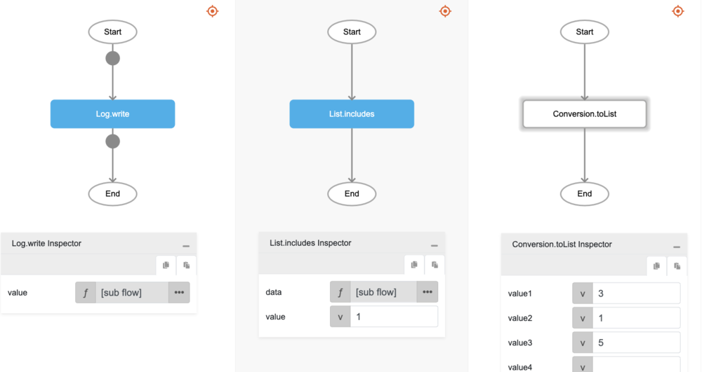

# List.includes

## Description

Determines whether a list includes a certain value.

## Input / Parameter

| Name | Description | Input Type | Default | Options | Required |
| ------ | ------ | ------ | ------ | ------ | ------ |
| data | The list to be searched. | List | - | - | Yes |
| value | The value to look for. | Any | - | - | Yes |

## Output

N/A

## Callback

N/A

## Video

Coming Soon.

## Example

The user wants to check whether a value is included in a List and print the result in the console.
 

### Step

1. Call the function `List.includes` inside the `Log.write` function, and then Call the function `Conversion.toList` inside the `List.includes`.
     

    

### Result

The console will print `true`.

## Related Information