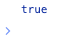

# List.includes

## Description

Determines whether a list includes a certain value.

## Input / Parameter

| Name | Description | Input Type | Default | Options | Required |
| ------ | ------ | ------ | ------ | ------ | ------ |
| data | The list to be searched. | List | - | - | Yes |
| value | The value to look for. | Any | - | - | Yes |

## Output

N/A

## Example

In this example, we will check whether a value is included in a list and print the result in the console.

### Step

1. Drag a `button` component to the canvas and open the `Action` tab. Select the `press` event of the button and drag the `Log.write` function to the event flow.
2. Call the function `List.includes` inside the `Log.write` function.
3. Then call the function `Conversion.toList` inside the `data` parameter of the `List.includes` function. Enter the value to be checked for in the list in the `value` parameter.
4. Enter the values of the list to be passed in the `Conversion.toList` function.

### Result

1. The console will print `true` if the value exists in the list and `false` if the value does not exist in the list.
2. In this example, the value printed will be `true`.

