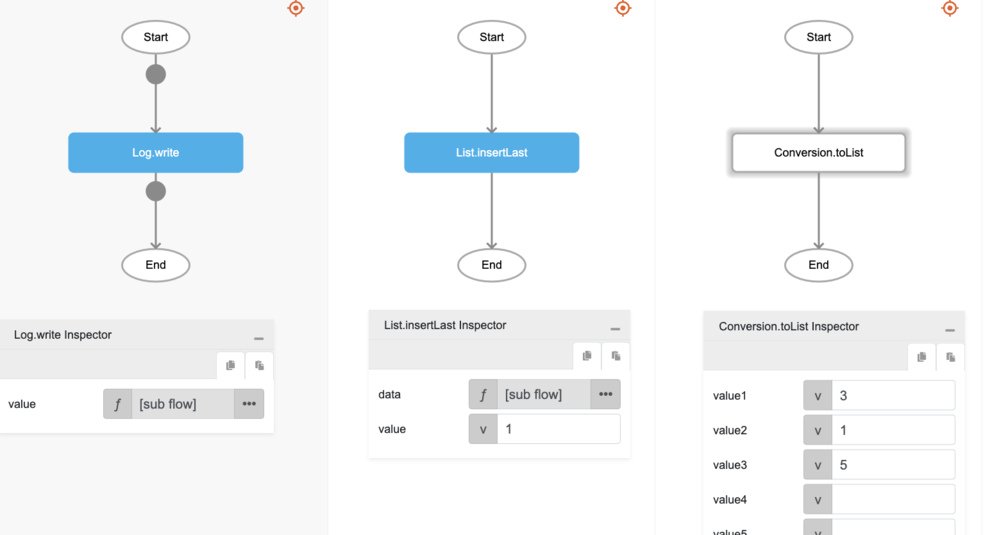

# List.insertLast

## Description

Inserts an element to the back of a list.

## Input / Parameter

| Name | Description | Input Type | Default | Options | Required |
| ------ | ------ | ------ | ------ | ------ | ------ |
| data | The list to be updated. | List | - | - | Yes |
| value | The element to be added to the list. | Any | - | - | Yes |

## Output

| Description | Output Type |
| ------ | ------ |
| Returns the updated list. | List |

## Callback

N/A

## Video

Coming Soon.

## Example

The user wants to insert a value in the last index of a List and print the result in the console.
 

### Step

1. Call the function `List.insertLast` inside the `Log.write` function, and then Call the function `Conversion.toList` inside the `List.insertLast`.
     

    

### Result

The console will print `3,1,5,1`.

## Related Information