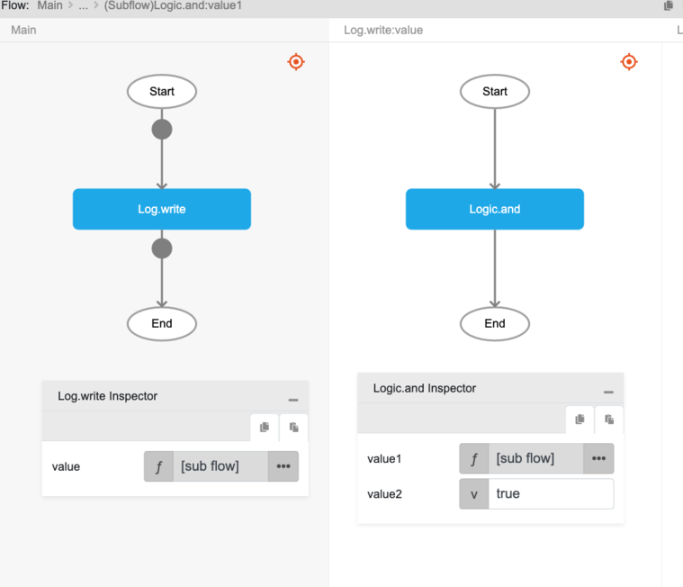
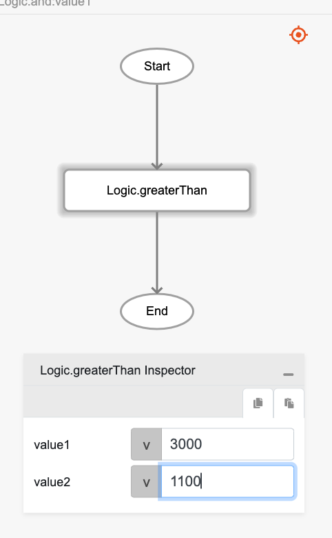
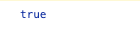

# Logic.and

## Description

'and' operator is a boolean operator that returns true if both operands are true and returns false otherwise. 

## Input / Parameter

| Name | Description | Input Type | Default | Options | Required |
| ------ | ------ | ------ | ------ | ------ | ------ |
| value1 | The first boolean value to check. | Boolean | - | - | Yes |
| value2 | The second boolean value to check. | Boolean | - | - | Yes |

## Output

| Description | Output Type |
| ------ | ------ |
| Returns true if both operators are true, returns false otherwise. | Boolean |

## Example

In this example, we will check if the two values passed are both true and return the result in the console.
</br>

### Step

1. Drag a `button` component into the canvas and open the `Action` tab. Select the `press` event of the button and drag the `Log.write` function to the event flow.

2. Call the function `Logic.and` inside the `Log.write` function.
    
    ```js
    value1: Logic.greaterThan function
    value2: true
    ```
    <div style="display:flex; align-items:center; justify-content:center; background-color: #E7F1FF;">
        
    </div>

3. Call the function `Logic.greaterThan` inside the `value1` parameter of the `Logic.and` function.

    ```js
    value1: 3000
    value2: 1100
    ```
    <div style="display:flex; align-items:center; justify-content:center; background-color: #E7F1FF;">
        
    </div>

### Result

1. The console will print `true` since `value1` will return 'true' (3000 is greater than 1100) which matches the input for `value2` (true).

    <div style="display:flex; align-items:center; justify-content:center; background-color: #E7F1FF;">
        
    </div>

