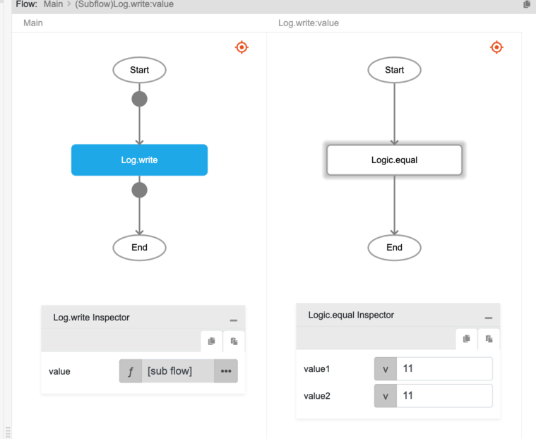

# Logic.equal

## Description

The equal to comparison operator. It checks whether two values are equal. The result will return boolean values, true or false.

## Input / Parameter

| Name | Description | Input Type | Default | Options | Required |
| ------ | ------ | ------ | ------ | ------ | ------ |
| value1 | The first value to check. | Any | - | - | Yes |
| value2 | The second value to check. | Any | - | - | Yes |

## Output

| Description | Output Type |
| ------ | ------ |
| Returns true if both values are equal, returns false otherwise. | Boolean |

## Example

In this example, we will check if the two values passed are equal and print the result in the console.

### Step

1. Drag a `button` component into the canvas and open the `Action` tab. Select the `press` event of the button and drag the `Log.write` function to the event flow.
2. Call the function `Logic.equal` inside the `Log.write` function.

    ```js
    value1: 11
    value2: 11
    ```
    <div style="display:flex; align-items:center; justify-content:center; background-color: #E7F1FF;">
        
    </div>    

### Result

1. The console will return `true`.