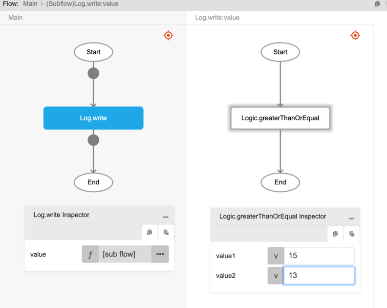

# Logic.greaterThanOrEqual

## Description

The equal to or greater than comparison operator. It checks whether the first value is greater than or equal to the second value. The result will return boolean values, true or false.

## Input / Parameter

| Name | Description | Input Type | Default | Options | Required |
| ------ | ------ | ------ | ------ | ------ | ------ |
| value1 | The first value to check. | Number | - | - | Yes |
| value2 | The second value to check against. | Number | - | - | Yes |

## Output

| Description | Output Type |
| ------ | ------ |
| Returns true if the first value is greater than or equal to the second value, returns false otherwise. | Boolean |

## Example

In this example, we will check if the first value passed is greater than or equal to the second value passed and print the result in the console.

### Step

1. Drag a `button` component into the canvas and open the `Action` tab. Select the `press` event of the button and drag the `Log.write` function to the event flow.
2. Call the function `Logic.greaterThanOrEqual` inside the `Log.write` function.
    
   value1 : 15 
   value2 : 13  
   
    

### Result

1. The console will return `true`.