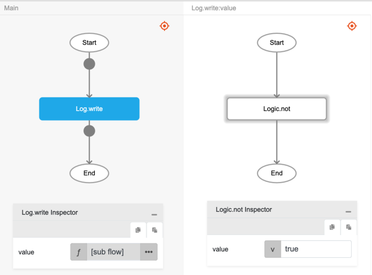

# Logic.not

## Description

'not' operator is a Boolean operator that returns true when the operand is false, and returns false when the operand is true. Essentially, the operator reverses the logical value associated with the expression on which it operates.

## Input / Parameter

| Name | Description | Input Type | Default | Options | Required |
| ------ | ------ | ------ | ------ | ------ | ------ |
| value | The input to be checked against. | Boolean | - | - | Yes |

## Output

| Description | Output Type |
| ------ | ------ |
| Returns true if operator is false, returns false otherwise. | Boolean |

## Example

In this example, we will return the reverse of the value passed and print the result in the console.
 

### Step

1. Drag a `button` component into the canvas and open the `Action` tab. Select the `press` event of the button and drag the `Log.write` function to the event flow.
2. Call the function `Logic.not` inside the `Log.write` function.
     
    value : true

    

### Result

1. The console will print 'false' since `value` is 'true'.
