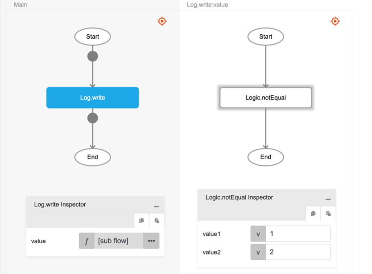

# Logic.notEqual

## Description

The 'not equal to' comparison operator. It checks that two values are not equal. The result will return boolean values, true or false.

## Input / Parameter

| Name | Description | Input Type | Default | Options | Required |
| ------ | ------ | ------ | ------ | ------ | ------ |
| value1 | The first value to check. | Any | - | - | Yes |
| value2 | The second value to check. | Any | - | - | Yes |

## Output

| Description | Output Type |
| ------ | ------ |
| Returns true if the two values are not equal, returns false otherwise. | Boolean |

## Example

In this example, we will check that the two values passed are not equal to each other and return the result in the console.

### Step

1. Drag a `button` component into the canvas and open the `Action` tab. Select the `press` event of the button and drag the `Log.write` function to the event flow.
2. Call the function `Logic.notEqual` inside the `Log.write` function.
     
    value1 : 1 
    value2 : 2 

    
     

### Result

1. The console will return `true`.