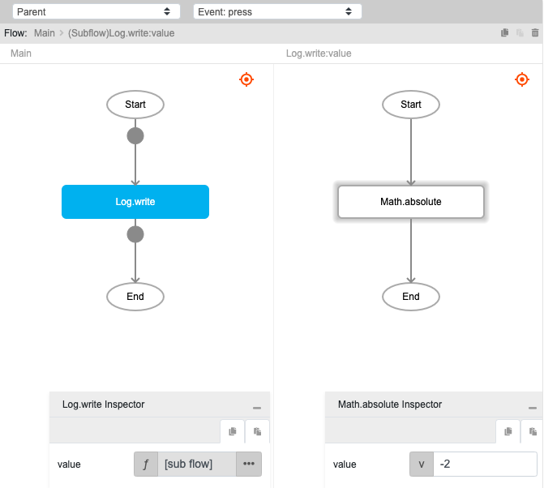
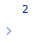

# Math.absolute

## Description

Absolute is used to return the absolute value (non-negative value) of a number. If the value is a negative number, the output returned will be the non-negative value, otherwise, the same value will be returned.

## Input / Parameter

| Name | Description | Input Type | Default | Options | Required |
| ------ | ------ | ------ | ------ | ------ | ------ |
| value | The number to return the absolute of. | Number | - | - | Yes |

## Output

| Description | Output Type |
| ------ | ------ |
| Returns the absolute value. | Number |

## Example

In this example, we will get the absolute of a value and print it in the console.

### Steps

1. Drag a `button` component into the canvas and open the `Action` tab. Select the `press` event of the button and drag the `Log.write` function to the event flow.
2. Call the function `Math.absolute` inside the `Log.write` function.
3. Enter the value to get the absolute of.

### Result

1. The console will print `2`.

