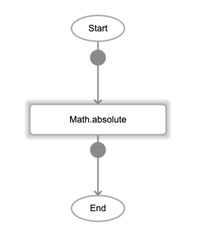
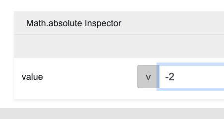

# Math.absolute

## Description

Absolute is used to return the absolute value (non-negative value) of a number. If the value is a negative number, the output returned will be the non-negative value, otherwise, the same value will be returned.

## Input / Parameter

| Name | Description | Input Type | Default | Options | Required |
| ------ | ------ | ------ | ------ | ------ | ------ |
| value | The number to return the absolute of. | Number | - | - | Yes |

## Output

| Description | Output Type |
| ------ | ------ |
| Returns the absolute value. | Number |

## Callback

N/A

## Example

1. Drag the `Math.absolute` function into the event flow.

    

2. Enter the value to be processed. For this example it is -2.

    

### Result

2

## Links