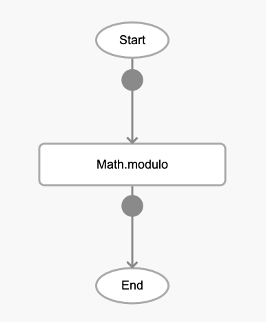
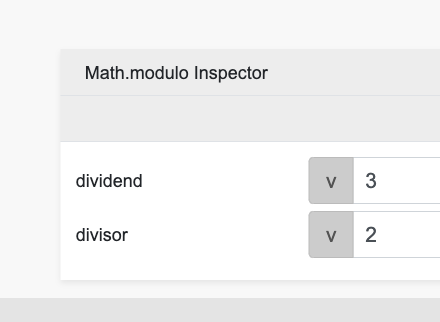

# Math.modulo

## Description

Get the remainder of two numbers after dividing them.

## Input / Parameter

| Name | Description | Input Type | Default | Options | Required |
| ------ | ------ | ------ | ------ | ------ | ------ |
| dividend | The number to be divided. | Number | - | - | Yes |
| divisor | The number to divide the first value by. | Number | - | - | Yes |

## Output

| Description | Output Type |
| ------ | ------ |
| Returns the remainder of the two values. | Number |

## Callback

N/A

## Video

Coming Soon.

<!-- Format: []({url-link}) -->

## Example

1. Drag the `Math.modulo` function into the event flow.

    

2. Enter the 2 values to be processed together. For this example they are `3` and `2`.

    
### Result

```
1
```

## Links