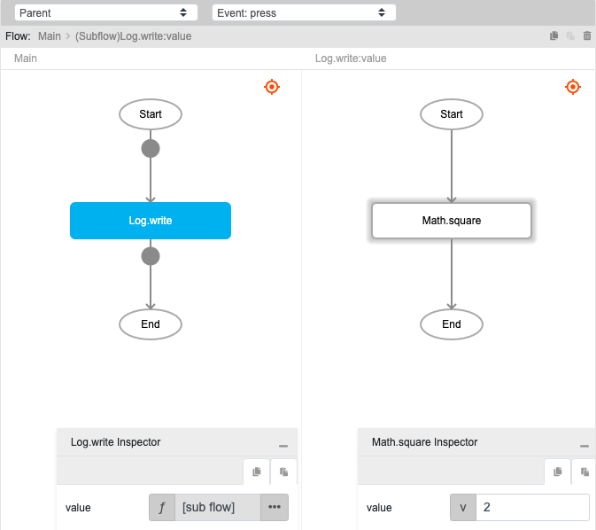

# Math.square

## Description

A squared number is the result of a number raised to the power of 2, or a number multiplied by itself.

## Input / Parameter

| Name | Description | Input Type | Default | Options | Required |
| ------ | ------ | ------ | ------ | ------ | ------ |
| value | The number to return the square of. | Number | - | - | Yes |

## Output

| Description | Output Type |
| ------ | ------ |
| Returns the squared value. | Number |

## Example

In this example, we will square a value and print the result in the console.

### Steps

1. Drag a `button` component into the canvas and open the `Action` tab. Select the `press` event of the button and drag the `Log.write` function to the event flow.
2. Call the function `Math.square` inside the `Log.write` function.
3. Enter the value to be squared.

### Result

1. The console will print `4`.

