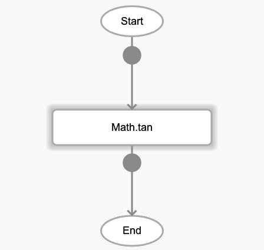
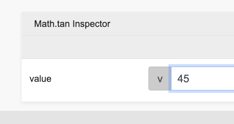

# Math.tan

## Description

Get the tangent of an angle, in radians. The output will return any real number.

## Input / Parameter

| Name | Description | Input Type | Default | Options | Required |
| ------ | ------ | ------ | ------ | ------ | ------ |
| value | The number to return the tangent of. | Number | - | - | Yes |

## Output

| Description | Output Type |
| ------ | ------ |
| Returns the tangent of an angle. | Number |

## Callback

N/A

## Video

Coming Soon.

<!-- Format:  -->

## Example

1. Drag the `Math.tan` function into the event flow.

    

2. Enter the value to be processed. For this example we use 45.

    

### Result

1.6197751905438615

## Links