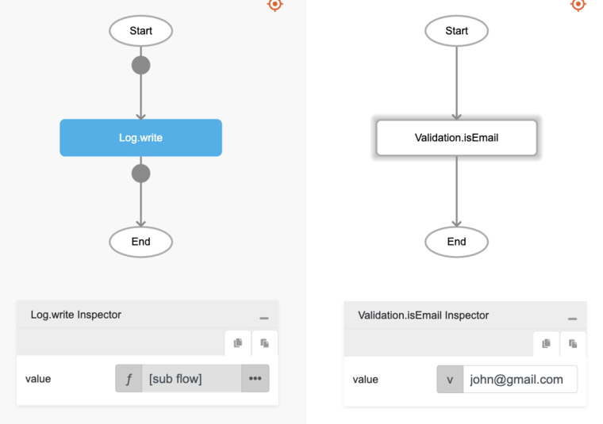

# Validation.isEmail

## Description

Checks whether the value input is a valid email.

## Input / Parameter

| Name | Description | Input Type | Default | Options | Required |
| ------ | ------ | ------ | ------ | ------ | ------ |
| value | The value to be checked. | Any | - | - | Yes |

## Output

N/A

## Callback

N/A

## Video

Coming Soon.

## Example

The user wants to check whether an email is valid and print the result in the console.
 

### Step

1. Call the function `Conversion.isEmail` inside the `Log.write` function.
     
    value : "john@gmail.com"

    

### Result

The console will print `true` since it is a valid email by format.

## Links