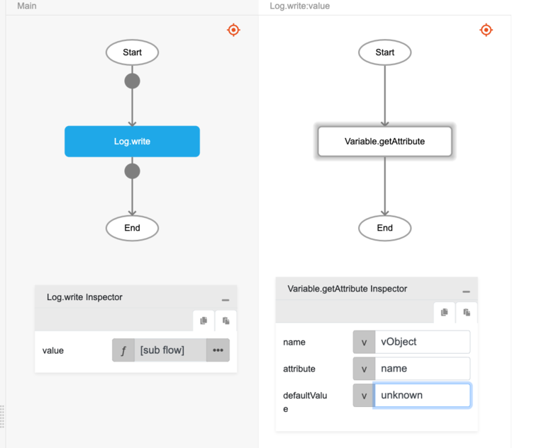

# Variable.getAttribute

## Description

Retrieves value from an attribute of an object variable in the application's local variable pool.

## Input / Parameter

| Name | Description | Input Type | Default | Options | Required |
| ------ | ------ | ------ | ------ | ------ | ------ |
| name | The variable's identifier containing the object. | Text | - | - | Yes |
| attribute | The attribute name of the object variable to retrieve value from. | Text | - | - | Yes |
| defaultValue | The default value to be used if the attribute does not exist or does not contain a value. | Any | - | - | No |

## Output

| Description | Output Type |
| ------ | ------ |
| The stored variable's value from the attribute, or null if the value does not exist, variable is not an object and default value is not supplied. | Any |

## Example

In this example, we will use a value of an attribute from global variable which had been declared.

### Steps

1. Assuming you have followed the "Variable.setAttribute" fuction in help document, call the function.

### Result

1. In console, user can see the string `Johnny`. If user variable `vObject` have no value, it will display `unknown`.

| Variable exists | Variable does not exist | 
| ---- | ---- | 
| If the specified global variable attribute has previously been set (see [`setAttribute`](./setAttribute)), the function will return the variable attribute's value: ("Johnny" in this example)    | If the specified global variable attribute does not exist, the function will return the value in `defaultValue`:     |

## Related Information

* See also `Variable.setAttribute`