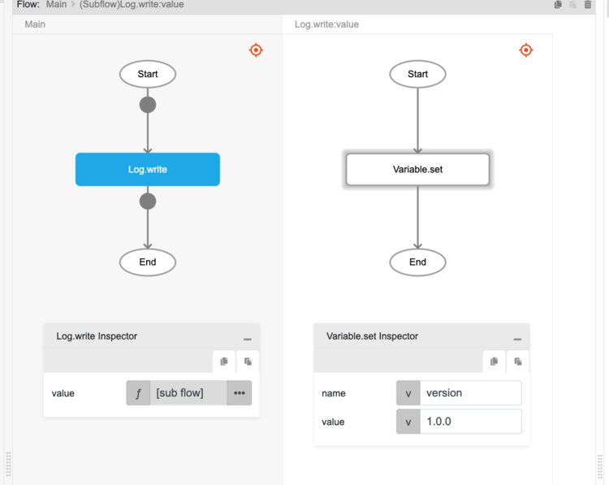
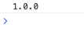

# Variable.set

## Description

Creates a global variable with a value associated to it.

## Input / Parameter

| Name | Description | Input Type | Default | Options | Required |
| ------ | ------ | ------ | ------ | ------ | ------ |
| name | The name of the variable to create. | String/Text | - | - | Yes |
| value | The value associated to the variable. | String/Text | - | - | No |

## Output

| Description | Output Type |
| ------ | ------ |
| Returns the formatted information. | Object |

### Object

| Key | Description | Output Type |
| ------ | ------ | ------ |
| success | Boolean value to denote whether the function was executed successfully. | Text |
| message | The message to print. | Text |
| data | Any additional message or data to print. | Text |

## Callback

N/A

## Video

Coming Soon.

<!-- Format:  -->

## Example

### Steps

1. Drag the `Log.write` function and then inside the `value` parameter put in function `Variable.set` into the subflow window. 
2. Create a variable called `version` with the value `1.0.0`

3. This will create a global variable called "version" containing the value "1.0.0" that can be accessed by other components or on other pages of your app.

### Result

The value of the global variable `version` can be accessed by using the `Variable.get`. 

Using the above flow will display the value `1.0.0` in the browser console.

 

## Related Information

* See also `Variable.get`