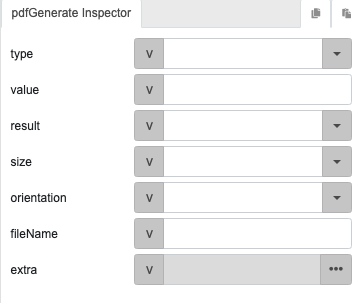
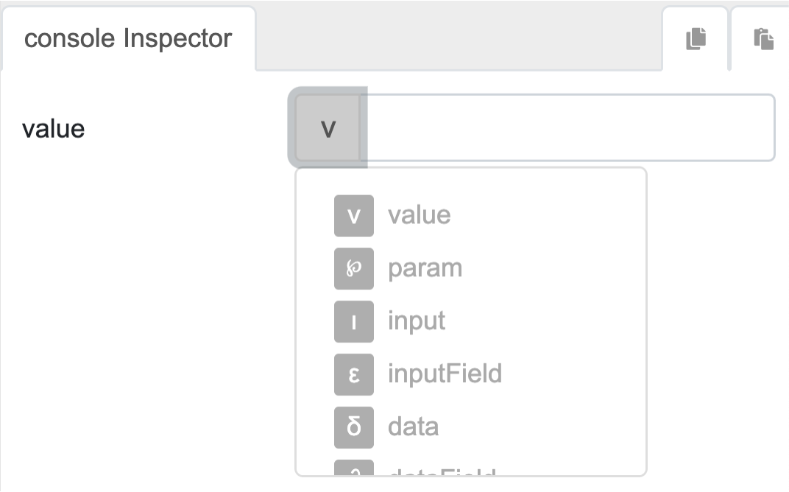

# Logic Block and Parameter Types

## Introduction

This section provides a detailed overview of the Logic Blocks and Parameter Types in the eMOBIQ platform. Understanding these concepts is crucial for creating functional app logic without writing any code.

## Glossary of Terms
Before we dive into the details of Logic Blocks and Parameter Types, it's essential to understand some key terms that will be used throughout this documentation:

1. **Logic Block / Action / Function:** A fundamental building block in the eMOBIQ platform that represents a specific operation or calculation. Logic blocks take in specified parameters and produce an output (if applicable).

2. **Parameter:** An input value that is required by a logic block to perform its operation. Parameters can be of different types, like 'param', 'value', 'data', 'dataField', 'input', 'inputField', 'extra', and 'function'.

3. **Callback Logic Block:** A logic block that is executed after the completion of another logic block, known as the source logic block. The callback logic block can use the output of the source logic block as its input.

4. **Source Logic Block:** A logic block whose output is used as input by another logic block, known as the callback logic block.

5. **Global Function:** A reusable piece of logic created by the user that can be utilized throughout the app. Global functions are created by combining multiple logic blocks and can take predefined static inputs (parameters).

## Logic Blocks (/Actions/Functions)

Logic blocks, actions, and functions refer to the same thing in this documentation, and will be used interchangeably. Logic blocks are fundamental building blocks that enable users to create functional app logic without writing code. Each logic block acts like a function in traditional programming, taking in a specified number of parameters and producing an output (if applicable). By connecting these logic blocks together in a visual logic interface, users can create complex and interactive app functionalities.

<!--  -->

By chaining logic blocks together, users create a visual representation of their app's logic. This visual logic interface allows users to build and customize their app's behavior without writing traditional code, making app development accessible to a broader audience with varying technical backgrounds.

## Logic Block Parameters
Each logic block encapsulates specific operations or calculations based on the chosen parameters. The user can define the logic block's behavior using the given parameters and parameter types.

The following example shows the parameters for the action 'pdfGenerate':



Users can edit the value within these parameters to acheive their desired output. For more information about the parameters and output for each action, please refer to the action reference.

## Parameter Types
There are a few ways to pass value to a logic block parameter as inputs. The parameter type defines where this value is coming from.



The illustration above shows a typical interface (the dropdown) for choosing the parameter type for a logic block in the inspector. The remaining of this section will describe the sources of data for these parameter types.

### 1. **'param' Parameter Type**

#### **Context**

- 'param' parameters are used for building global functions.
- They represent fixed text inputs provided by the user based on the parameter name of the global function.
- Global functions are reusable pieces of logic that can be utilized throughout the app with predefined static inputs.

#### **Example**

If you have a global function that sends a notification, you might have a parameter called 'message' where you can specify the message that will be sent. To reference values passed to this parameter when the global function is called, you need to use the 'param' parameter type and 'message' as the parameter value.

### 2. **'value' Parameter Type**

#### **Context**

- 'value' parameters are directly taken from raw input values provided by the user.
- When users interact with the app, they input static values that are then used as parameters within logic blocks.
- This allows users to set specific, unchanging values for the logic to operate on.

#### **Example**

If you have a logic block that sends an email, with a 'message' parameter, you can use the 'value' parameter type to directly key in the raw message content for the logic block.

### 3. **'data' and 'dataField' Parameter Types**

#### **Context**
- The 'data' and 'dataField' parameters process dataset from datalist on a per-record basis.
- 'data' and 'dataField' are parameter types used exclusively within the dataList (item) component or components within a dataList component.
- Note: This section assumes you understand how dataLists work. For more information, refer to the DataLists section.

#### **Example**
Consider the dataset record provided by Datalist:

```json
{
  "name": "John Doe",
  "age": 30,
  "height": 181
}
```

**'data' parameter type** refers to the whole record:

```json
{
  "name": "John Doe",
  "age": 30,
  "height": 181
}
```
**'dataField' parameter type** refers to the specific field of a record that is provided by the Datalist's dataset.

For example, if you only need the user's age, by changing the parameter type of a logic block to 'dataField' and specifying the value as 'age', you get the following result:

```
30
```

### 4. **'input', 'inputField', and 'extra' Parameter Types**

#### **Context**
- 'input', 'inputField', and 'extra' parameters allow source logic blocks to pass data to its callback logic block(s).
- 'input' and 'inputField' retrieves data from the output result of the source logic block.
- 'extra' retrives data from the source logic block's extra parameter. Ony applicable if the source logic block has an extra parameter.

#### **Example** ('input' and 'inputField')
Consider a source logic block retrieves the user's profile data and outputs the following result:

```json
{
  "userId": 123,
  "name": "John Doe",
  "email": "johndoe@example.com",
  "age": 30
}
```

**'input' Parameter Type** used in a callback logic block refers to the whole record passed from the source logic block's output:

```json
{
  "userId": 123,
  "name": "John Doe",
  "email": "johndoe@example.com",
  "age": 30
}
```

**'inputField' Parameter Type** used in a callback logic block refers to a specific field or attribute inside the record passed from the source logic block's output.

This is useful when we only need certain pieces of information from the source data. For example, if we only need the user's name from the source logic block output, we can use the 'inputField' parameter type in the callback logic block with 'name' as its value. This specifies that only data in the 'name' field is passed from the source output to the callback logic block. We then get the following result:

```json
{
   "name": "John Doe"
}
```
#### **Example** ('extra')
If you want to pass additional styling information to a callback function to customize its appearance, you can put the following data object inside the extra parameter in the source logic block:

```json
// Custom styling information defined in the extra parameter of source logic block. (This data structure can be achieved with toObject function)
{
  "backgroundColor": "#F0F0F0",
  "fontSize": "16px"
}
```

**'extra' Parameter Type** used in a callback logic block refers to the whole data inside the extra parameter of the source logic block:

```json
{
  "backgroundColor": "#F0F0F0",
  "fontSize": "16px"
}
```
      
Note: The 'extra' parameter allows source logic blocks to pass any additional data to a callback logic block. This is gives more flexibility to relay data between source and callback logic block.
   
### 5. **'function' Parameter Type**

#### **Context**
- The 'function' parameter type is used when the value is taken from the result of a subflow logic, similar to using functions as arguments in traditional programming.
- A subflow logic represents a separate flow of logic that helps to improve readability and cleanliness of the visual logic space.
- When using a 'function' parameter type, the output of the last logic block in the subflow logic will be used as the result of the subflow. This result is then used as the parameter value.

#### **Example**
Given that you are working on a logic block which requires the total price of items in a shopping cart as an input, you can use the 'function' parameter type to implement the logic for the calculation.