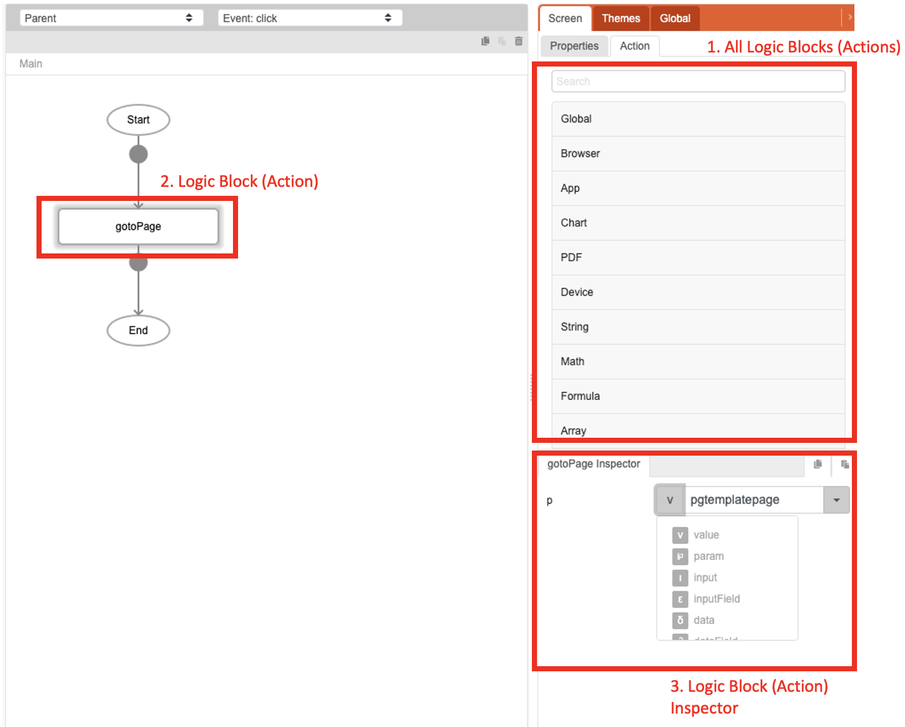

# Visual Interfaces

This section will provide you with a visual overview of logic blocks and parameters in eMOBIQ.
There are three key areas that are involved when user use logic blocks. These interfaces are as illustrated in the example below:

1. **All Logic Blocks**

   In the section which indicates "All Logic Blocks", it contains the list of all actions/logic blocks that are available for use. Here, you can drag various logic blocks into visual logic space on the left to design the functionalities of your app.

2. **Logic Block Example**

   The "Logic Block Example" showcases a specific logic block in action. This visual representation allows you to see how a logic block is displayed in the visual logic space and how it functions within your application. You can drag more actions from the action list into the workspace and connect different logic blocks together to build more sophisticated logic.

3. **Logic Block Inspector**

   The "Logic Block Inspector" opens the configuration view of a selected logic block. This interface allows you to delve into the details of a logic block's input parameters. This inspector allows users to configure the selected logic block accordingly to change the logic block behaviour to meet specific requirements. Use the action reference to explore the different behaviours of logic blocks.
