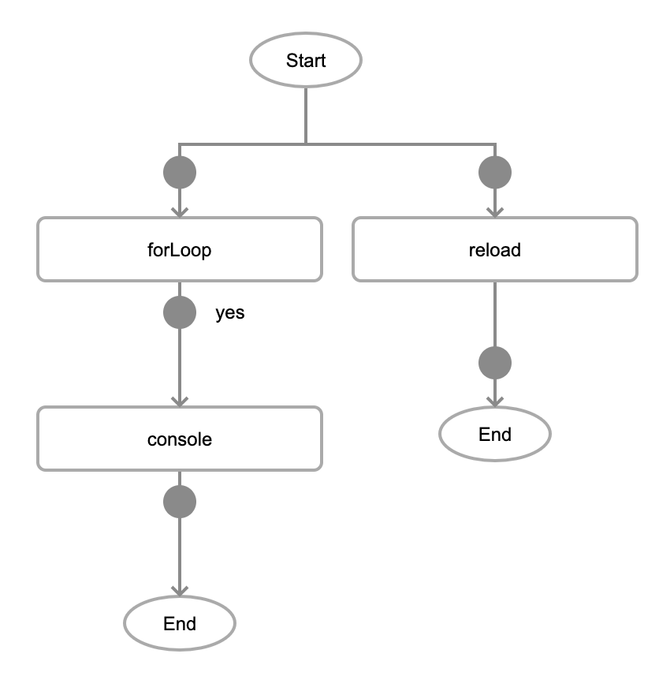

<!-- # Loops

In programming and app development, loops are essential constructs used to execute a set of instructions repeatedly until a certain condition is met. In eMOBIQ, loops are facilitated using the 'forLoop' logic block, which allows users to create iterative behavior through a visual representation. Let's dive into what loops are and how they are implemented in the visual logic using the 'forLoop' block:

## Understanding Loops:
A loop is a programming concept that enables the repeated execution of a sequence of instructions based on a specified condition. It allows developers to efficiently perform repetitive tasks, such as iterating over a collection of elements, executing code a certain number of times, or continuing until a particular condition is satisfied.

## The 'forLoop' Logic Block
The 'forLoop' logic block is a fundamental building block in the visual logic of eMOBIQ. It is designed to represent a basic form of a loop that iterates over a range of values for a given set of instructions. The block has three main parameters:

    1. 'start': This parameter represents the starting value of the loop. It is a number that defines the initial point from which the loop should begin its iterations.

    2. 'end': This parameter defines the end value of the loop. The loop will continue executing until it reaches or exceeds this value.

    3. 'callback': The 'forLoop' block requires a callback function as an argument. This callback function contains the logic that should be executed during each iteration of the loop.

* Note: The 'Yes' callback in forLoop lets users add logic block to the body of the forLoop. Other logic blocks placed on the same level as the forLoop will be executed after the forLoop.

## Implementing Loops in Visual Logic
To create a loop using the 'forLoop' block, users of your no-code app development platform can follow these steps:

    1. Drag and drop the 'forLoop' logic block from the available components into the canvas.

    2. Set the 'start' and 'end' parameters by connecting them to number inputs or by specifying numeric values directly.

    3. Create the loop's logic by adding and connecting other logic blocks within the 'callback' section. This represents the body of the loop that will be executed repeatedly.

    4. Ensure that the logic inside the 'callback' section makes use of the loop variable (e.g., the loop index) to perform different actions during each iteration.

## Loop Visualization
The visual representation of the 'forLoop' block in the tree visualization typically looks like this:

In this example, by inserting the 'console' block as the 'Yes' callback of the 'forLoop' block, it becomes the body of the for loop and thus will be executed at every loop iteration. The 'reload' block is placed on the same level as the 'forLoop' block, so it will run only after the 'forLoop' has finished its execution. -->

# The 'forLoop' in eMOBIQ

Loops in eMOBIQ allow you to repeat actions until specific conditions are met. The 'forLoop' block is a simple way to create loops in visual logic.

## Understanding Loops:

Loops in eMOBIQ are a way to repeat actions automatically until a particular requirement is fulfilled. This allows developers to efficiently perform repetitive tasks, like going through a collection of elements or executing a specific piece of code multiple times.

## The 'forLoop' Loop:

The 'forLoop' block is a fundamental component in eMOBIQ's visual logic. It represents a basic form of a loop that executes a set of instructions for a set number of times, based on the range of values defined by the user. This block has three essential parameters:

1. 'start': Represents the starting value of the loop, acting as the initial point for iterations.

2. 'end': Defines the end value of the loop, determining when the loop stops executing.

3. 'callback': Requires a callback function as an argument, containing the logic to be executed during each iteration of the loop.

## Implementing forLoops in Visual Logic:

To create a loop using the 'forLoop' block in eMOBIQ's visual logic, follow these steps:

1. Drag and drop the 'forLoop' logic block onto the visual logic canvas.

2. Set the 'start' and 'end' parameters to define the range of iterations.

3. Create the loop's logic by adding and connecting other logic blocks within the 'Yes' callback. This represents the body of the loop that will be executed repeatedly.

4. Ensure that the logic inside the 'callback' section utilizes the loop variable (i.e., the loop index) to perform different actions during each iteration. The loop index value is accessible using the 'input' parameter in the child logic block.

## Loop Visualization
The visual representation of the 'forLoop' block in the tree visualization typically looks like this:

In this example, by inserting the 'console' block as the 'Yes' callback of the 'forLoop' block, it becomes the body of the for loop and thus will be executed at every loop iteration. The 'reload' block is subsequently placed on the same level as the 'forLoop' block, so it will run only after the 'forLoop' has finished its execution.

<!-- --- -->

<!-- # The 'Map' Iterator in eMOBIQ

The 'map' logic block is designed for working with arrays. It allows you to iterate over elements in the array and apply the same operation to each element, streamlining data manipulation and processing.

## Understanding the 'Map' Iterator:

The 'Map' iterator in eMOBIQ is like a tour guide that takes you through each element in an array, applying the same operation to all elements. It simplifies data processing, making it easier to perform repetitive operations uniformly.

## Key Features of 'Map':

- It takes an array as input and processes each element using the specified 'callback' logic.

To use 'Map':

1. Drag and drop the 'Map' component onto the visual logic canvas.

2. Connect the array you want to process to the 'map' logic block input.

3. Add the logic blocks inside the 'callback' to apply the desired operation to each element. -->

<!-- --- -->

<!-- ## Map iterator Visualization
The visual representation of the 'forLoop' block in the tree visualization typically looks like this:

In this example, by inserting the 'console' block as the 'Yes' callback of the 'forLoop' block, it becomes the body of the for loop and thus will be executed at every loop iteration. The 'reload' block is placed on the same level as the 'forLoop' block, so it will run only after the 'forLoop' has finished its execution. -->

<!-- --- -->

<!-- # Differences Between 'forLoop' and 'Map':

- 'forLoop' is a loop construct that iterates over a range of values, executing a callback for each iteration.

- 'Map' is an iterator specifically designed for arrays, applying the same callback logic to each element.

## Choose the Right Iterator:

Consider your data structure and the type of operation you want to perform when choosing between 'forLoop' and 'Map.' 'forLoop' is best suited for iterating over a specific range, while 'Map' is ideal for array processing with uniform operations.

By effectively utilizing these iterators in eMOBIQ's visual logic, you can streamline data processing, automate repetitive tasks, and build dynamic functionalities for your applications. -->

<!-- --- -->

<!-- # Example Uses for 'forLoop' and 'Map':

### When to use 'forLoop':

1. Countdown Timer: If you want to create a countdown timer that displays numbers from 10 to 1, you can use the 'forLoop' to iterate through the range of numbers.

2. Repeating Actions: When you need to perform a specific action a fixed number of times, like printing "Hello" five times, you can use the 'forLoop' to repeat the action.

3. Iterating Over Arrays: If you have an array of user names and you want to display them one by one in a list, you can use the 'forLoop' to iterate through the array.

### When to use 'Map':

1. Data Transformation: If you have an array of numbers and you want to double each number, you can use the 'Map' to apply the doubling operation to each element in the array.

2. Displaying Items: When you have an array of products, and you want to display their names on a webpage, you can use the 'Map' to show each product name.

3. Calculations on Arrays: If you have an array of prices, and you want to calculate the total cost, you can use the 'Map' to sum up all the elements in the array.

In general, use the 'forLoop' when you need to repeat actions for a fixed number of times or iterate over a range of values. Use 'Map' when you want to process each element of an array uniformly or apply the same operation to each element. Both 'forLoop' and 'Map' are valuable tools that can simplify data processing and repetitive tasks in your eMOBIQ applications. -->
