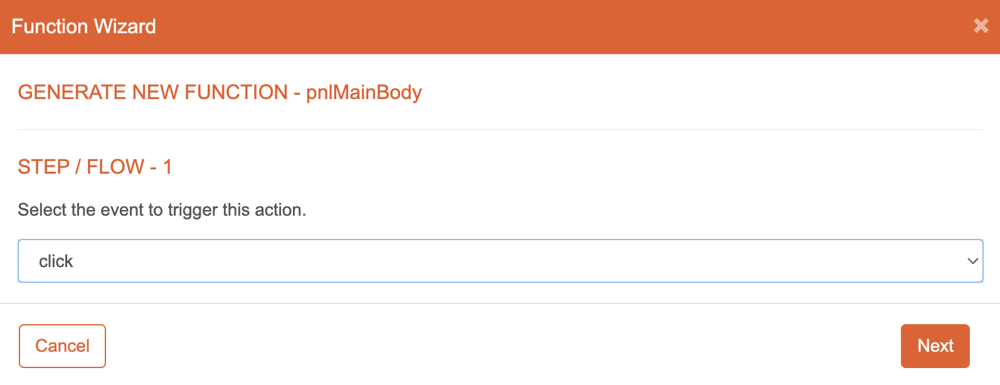
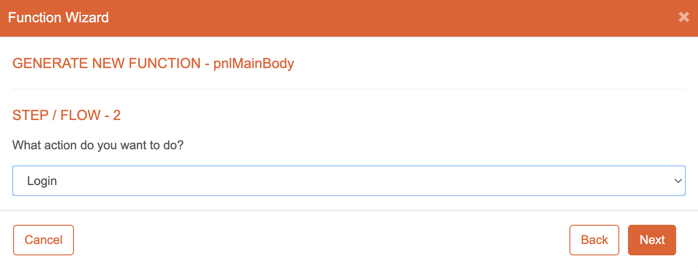
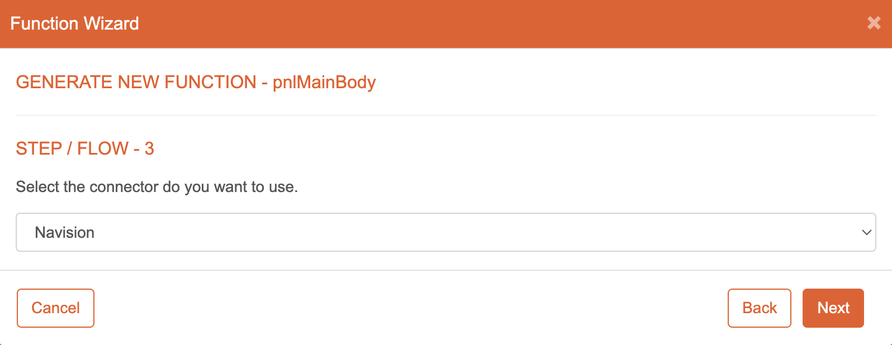
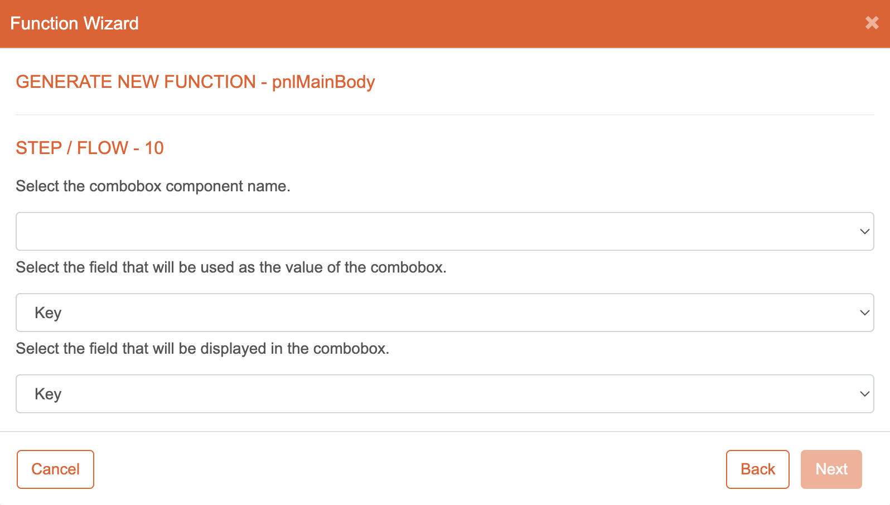
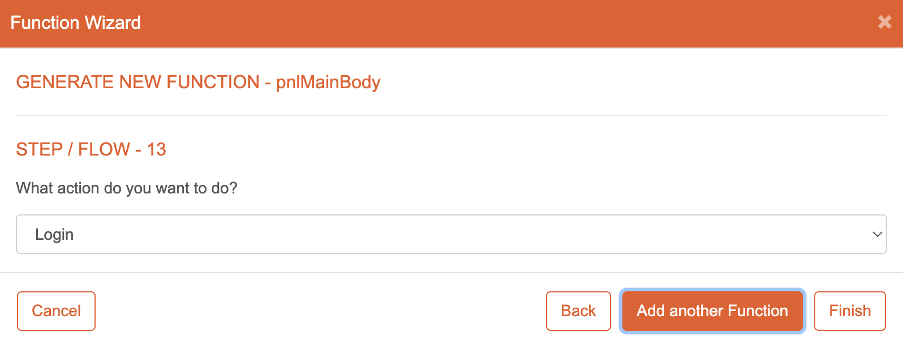
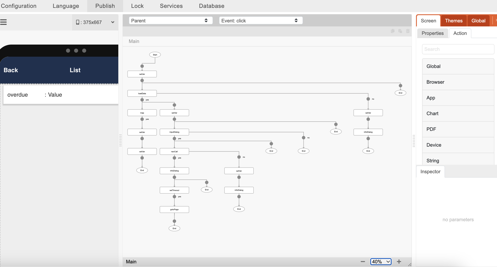

# Function Wizard

## Introduction

The Function Wizard in eMOBIQ is a powerful tool that simplifies the process of configuring logic for your components. It guides you through a step-by-step flow to define the actions that should be executed when a specific event associated with a component is triggered. This documentation will walk you through the flow of the Function Wizard, providing detailed instructions.

## Flow

1. **Choose the Event Trigger:**
 
    

    Start by selecting the event trigger for your component. This determines when the logic you configure will be executed. Choose from available events like click, load, or long press.

2. **Select Logic Type:** 

    

    Next, choose the type of logic that should be executed when the component's event is triggered. eMOBIQ offers a range of logic types, including login, calculate data, process data, retrieve data, and other basic logic types. Select the logic type that suits your desired functionality.

3. **Select Connector and Datasource:** 

    

    Now, select the connector and datasource that will be used to retrieve or manipulate the data for your logic. Connectors allow eMOBIQ to interact with external systems or services, while datasources provide the specific data required. Configure the necessary settings to connect to your desired datasource.

4. **Map Data to Component Value:** 

    

    In this step, map the data from the selected datasource to a component value. This ensures that the retrieved or manipulated data is properly assigned to (or taken from) the desired component. Use the provided interface to specify which fields from the datasource should be mapped to which component values.

5. **Continue Building Additional Logic:** 

    

    After completing the initial configuration, the Function Wizard allows you to continue building additional logic. This enables you to add more actions or conditions to enhance the functionality of your component. Repeat the previous steps to define multiple logic configurations for the same event trigger.

## Viewing output of wizard

The generated component trigger logic can be viewed in the **Visual Logic** section of eMOBIQ. Here, you can see a visual representation of the configured logic, making it easier to understand and manage the actions associated with your components.

## Conclusion

The Function Wizard in eMOBIQ streamlines the process of configuring logic for your components. By following the flow outlined in this documentation, you can effectively create powerful and customized functionality for components in your mobile app.
