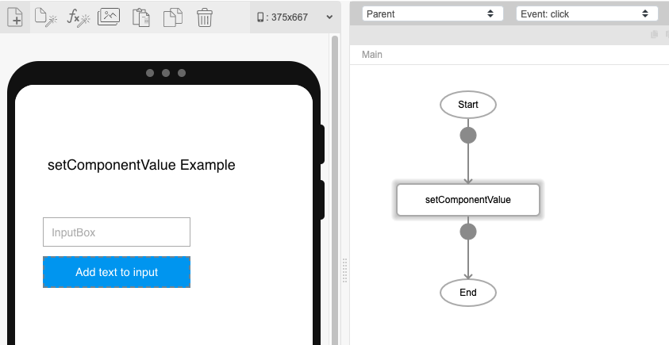
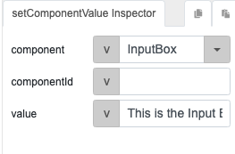
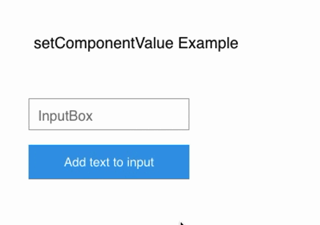

# App.setComponentValue

## Description

Allows users to set a value to a component.

## Input / Parameter

| Name | Description | Input Type | Default | Options | Required |
| ------ | ------ | ------ | ------ | ------ | ------ |
| component | The name of the component. | String/Text | - | - | Yes |
| value | The value to be set for the component. | String/Text | - | - | Yes |

## Output

N/A

Note: The component will be updated to show the value that has been set to it.

## Callback

N/A

## Video

## Example

### Steps

In this example we have a button (in blue) that when clicked will change the value of the form input component to say "This is the Input Box!" 

1. First, we drag a button and a form input onto the canvas.
2. Select the button and under the 'Actions' tab, drag the `App.setComponentValue` into the flow for the button. 

3. Under the inspector for this function, select the component whose value you would be changing, which in this example is `InputBox`.
4. Enter the new value to display. 

### Result

1. Save and preview your app. 
2. Now when you click the button, it will set the component value of InputBox to 'This is the Input Box!'

