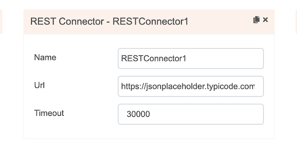

# restCall

## Description

A function to send an api call using RestConnector.

## Input / Parameter

| Name | Description | Input Type | Default | Options | Required |
| ------ | ------ | ------ | ------ | ------ | ------ |
| connector | The name of the connector service. | Text | - | - | Yes |
| path | the additional path to be added to te url. | Text | - | - | - |
| method | request method. | Text | - | - | - |
| query | query string params. | Text | - | - | - |
| callType | request call type. | Text | - | - | - |
| headers | request headers configuration. | Object | - | - | - |
| resultType | result type format of the api call response. | Text | - | - | - |
| cookies | cookies to be added to the request. | Array | - | - | - |
| body | request body. | Text | - | - | - |
| attachment | additional attachment / file to the request | Object | - | - | - |
| extra | extra parameter to pass into callback. | Text | - | - | - |

## Output

Formatted Result

## Callback

### callback

The function to be executed when the restCall runs successfully.

### errorCallback

The function to be executed when the restCall runs unsuccessfully.

## Video

Coming Soon.

<!-- Format:  -->

## Example

The user wants to do a rest api call using restCall function.

<!-- Share a scenario, like a user requirements. -->

### Steps

| No. | Description |  |
| ------ | ------ | ------ |
| 1. |  | Drag a `REST Connector` component into the services panel in the service page and then fill the fields. |
| 2. |  | Drag a button component to a page in the mobile designer. |
| 3. |  | Select the event `press` and drag the `Connector.restCall` function to the event flow and fill in the parameter. |
| 4. |  | Open the preview and try to press the Button, the rest api call should be visibile on the inspector network tab. |

<!-- Show the steps and share some screenshots.

1. .....

Format:  -->

### Result

Rest api call should run successfully.

<!-- Explain the output.

Format:  -->

## Links
