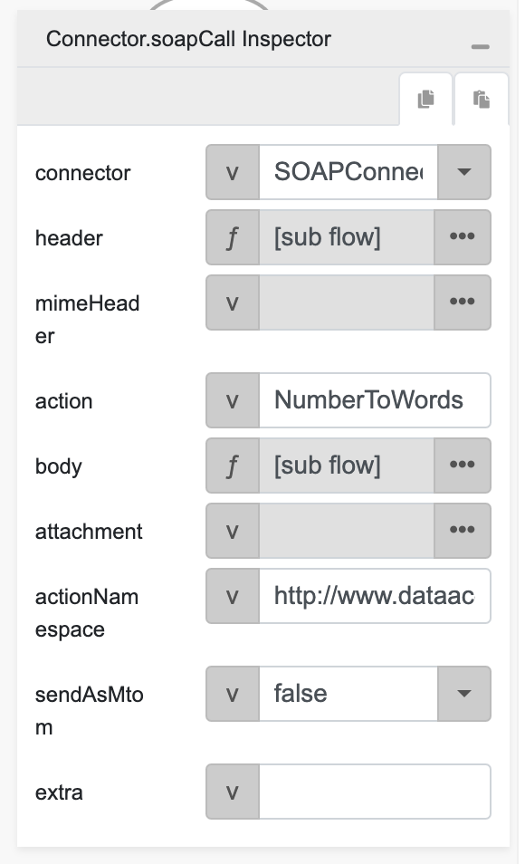
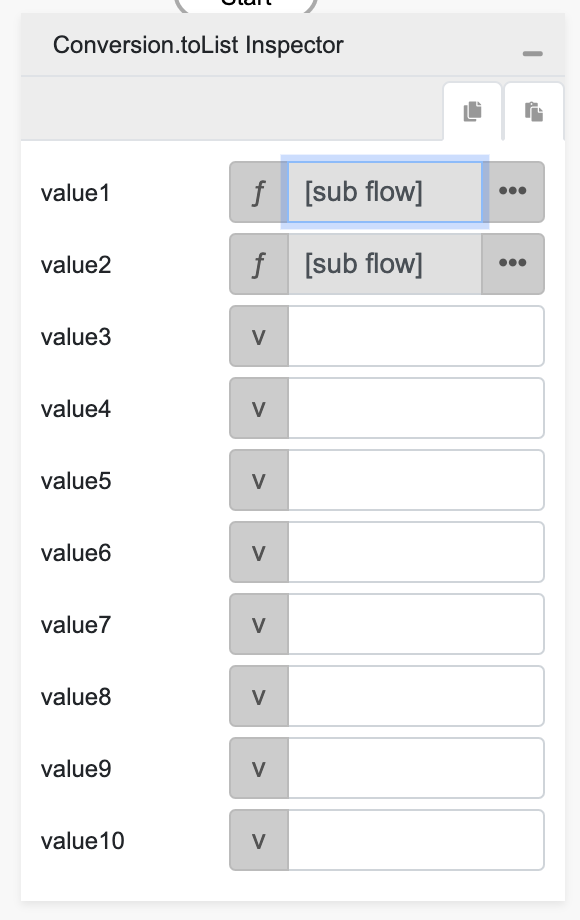

# soapCall

## Description

Makes a SOAP call using the given parameters and callbacks.

## Input / Parameter

| Name | Description | Input Type | Default | Options | Required |
| ------ | ------ | ------ | ------ | ------ | ------ |
| connector | The name of the connector service. | Text | - | - | Yes |
| header | The SOAP header to include in the request. | Object | - | - | - |
| mimeHeader | The MIME header to include in the request. | Object | - | - | - |
| action | The SOAP action to perform. | Text | - | - | - |
| body | The SOAP body of the request. | Object | - | - | - |
| attachment | The attachment to include in the request. | Object | - | - | - |
| actionNamespace | The namespace for the SOAP action. | Text | - | - | - |
| sendAsMtom | Set to true to send the request as MTOM. | Boolean | - | True, False | - |
| extra | extra parameter to pass into callback. | Text | - | - | - |

## Output

Formatted Result

## Callback

### callback

The function to be executed when the soapCall runs successfully.

### errorCallback

The function to be executed when the soapCall runs unsuccessfully.

## Video

Coming Soon.

<!-- Format:  -->

## Example

The user wants to do a soap call using soapCall function.

<!-- Share a scenario, like a user requirements. -->

### Steps

| No. | Description |  |
| ------ | ------ | ------ |
| 1. |  | Drag a `SOAP Connector` component into the services panel in the service page and then fill the fields. |
| 2. |  | Drag a button component to a page in the mobile designer. |
| 3. |  | Select the event `press` and drag the `Connector.soapCall` function to the event flow and fill in the parameter. |
| 4. |  | For the `header` param change it's type to a function / subflow and put `Conversion.toList` inside it, and change `value1` and `value2` param type to a function / subflow. |
| 5. |  | For `value1` value put `Conversion.toObject` inside it then add `localName`, `mustUnderstand`, `value` as object key with `Username`, `false`, `abcd` as it's value respectively. |
| 6. |  | For `value2` value put `Conversion.toObject` inside it then add `localName`, `mustUnderstand`, `value` as object key with `Password`, `false`, `1234` as it's value respectively. |
| 7. |  | For the `body` param change it's type to a function / subflow and put `Conversion.toObject` inside it, and then add `ubiNum` as object key with `1234` as it's value. |
| 8. |  | Open the preview and try to press the Button, the soap call should be visibile on the inspector network tab. |

<!-- Show the steps and share some screenshots.

1. .....

Format:  -->

### Result

Soap call should run successfully.

<!-- Explain the output.

Format:  -->

## Links
