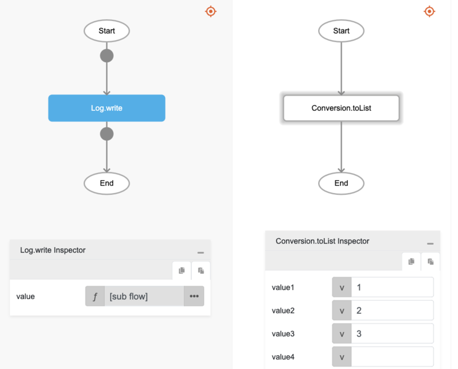
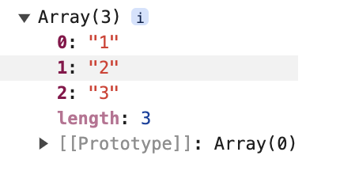

# Conversion.toList

## Description

Creates a list using the values provided or creates a new list.

## Input / Parameter

| Name | Description | Input Type | Default | Options | Required |
| ------ | ------ | ------ | ------ | ------ | ------ |
| data | Takes all the values passed and returns them as a list. | List | - | - | Yes |

* Note: DynamicList refers to being able to add multiple values as required.

## Output

| Description | Output Type |
| ------ | ------ |
| Returns the new list with the passed data. | List |

## Callback

N/A

## Video

Coming Soon.

## Example

The user wants to create an array of values and print the result in the console.
 

### Step

1. Call the function `Conversion.toList` inside the `Log.write` function.
     
    value : 1, 2, 3

    

### Result

The console will print an array of numbers as depicted below.
 

## Links