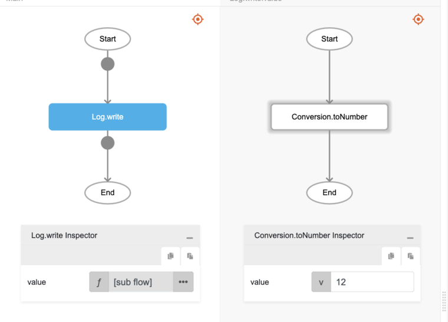

# Conversion.toNumber

## Description

Any number or text is converted to number type.

## Input / Parameter

| Name | Description | Input Type | Default | Options | Required |
| ------ | ------ | ------ | ------ | ------ | ------ |
| value | The value to be converted to number. | Text / Number | - | - | Yes |

## Output

| Description | Output Type |
| ------ | ------ |
| Returns the converted value as number type. | Number |

## Callback

N/A

## Video

Coming Soon.

## Example

The user wants to convert string to Number and print the result in the console.
 

### Step

1. Call the function `Conversion.toNumber` inside the `Log.write` function.
     
    value : 12

    

### Result

The console will print `12`.

## Links