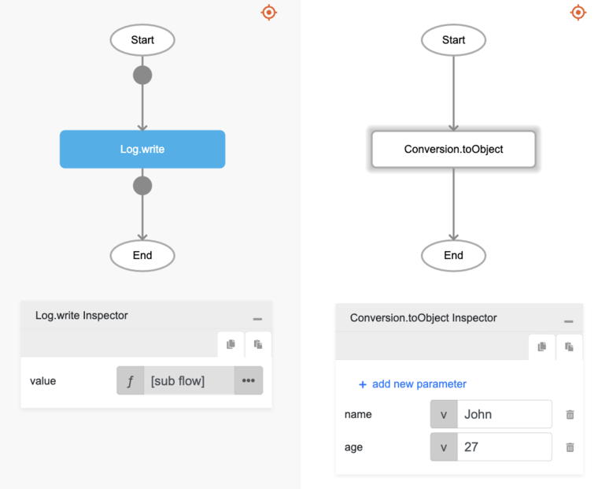

# Conversion.toObject

## Description

Creates an object using the key-value pairs provided or creates a new object.

## Input / Parameter

| Name | Description | Input Type | Default | Options | Required |
| ------ | ------ | ------ | ------ | ------ | ------ |
| {Dynamic} | {Based on user inputs.} | Any | - | - | No |

Note: Dynamic input means that user can add the necessary input required as key-value pairs.

## Output   

| Description | Output Type |
| ------ | ------ |
| Returns the new object with the passed data. | Object |

## Callback

N/A

## Video

Coming Soon.

## Example

The user wants to create an object and print the result in the console.
 

### Step

1. Call the function `Conversion.toObject` inside the `Log.write` function.
     
    value : {name: Johnny, age: 27}

    

### Result

The console will print an object as depicted below.
 

## Links