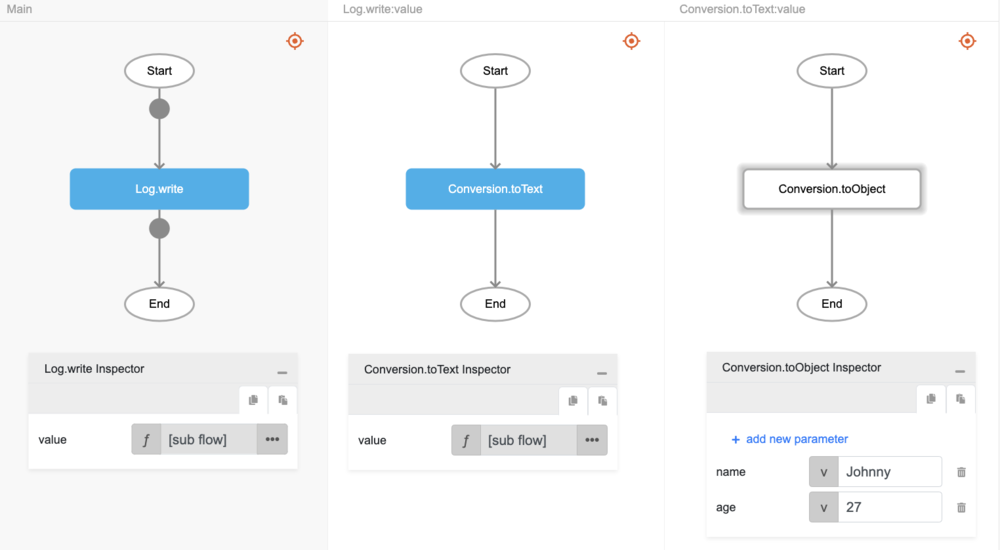

# Conversion.toText

## Description

A value of any type is converted to text type.

## Input / Parameter

| Name | Description | Input Type | Default | Options | Required |
| ------ | ------ | ------ | ------ | ------ | ------ |
| value | The value to be converted to text. | Any | - | - | Yes |

## Output

| Description | Output Type |
| ------ | ------ |
| Returns the converted value as text type. | Text |

## Callback

N/A

## Video

Coming Soon.

## Example

The user wants to convert an object to string and print the result in the console.
 

### Step

1. Call the function `Conversion.toText` inside the `Log.write` function, and then call the function `Conversion.toObject` inside `Conversion.toText`
     
    value : {"age":"27","name":"Johnny"}

    

### Result

The console will print `{"age":"27","name":"Johnny"}`.

## Related Information