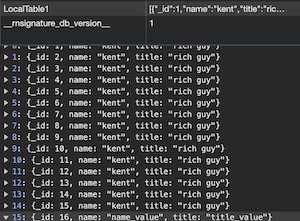

# insert

## Description

Insert rows of data into a dataset.

## Input / Parameter

| Name | Description | Input Type | Default | Options | Required |
| ------ | ------ | ------ | ------ | ------ | ------ |
| dataset | Name of the dataset that is created in services. | Text | - | - | Yes |
| data | Mapping of key-value pairs of data to insert. | Object | - | - | - |
| extra | extra parameter to pass into callback. | Text | - | - | - |

## Output

Formatted Result

## Callback

### callback

The function to be executed when the insert runs successfully.

### errorCallback

The function to be executed when the insert runs unsuccessfully.

## Video

Coming Soon.

<!-- Format:  -->

## Example

The user wants to insert rows of data to their local storage.

<!-- Share a scenario, like a user requirements. -->

### Steps

| No. | Description |  |
| ------ | ------ | ------ |
| 1. |  | Drag a `Local Table` component into the services panel in the service page and then fill the fields. |
| 2. |  | Drag a button component to a page in the mobile designer. |
| 3. |  | Select the event `press` and drag the `Dataset.insert` function to the event flow and fill in the parameter. |
| 4. |  | Open the preview and try to press the Button, new data should be added on local storage. |

<!-- Show the steps and share some screenshots.

1. .....

Format:  -->

### Result

The new rows of data should be stored on local storage.

<!-- Explain the output.

Format:  -->

## Links
